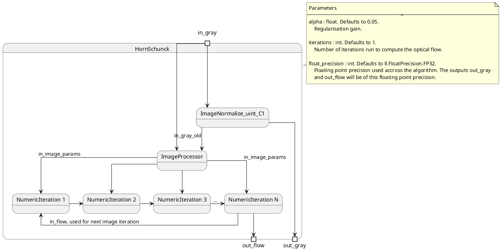
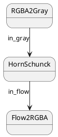


A Jupyter notebook with the code in this article is available in [Google Colab](https://colab.research.google.com/drive/1SPwxUIdYxCALD0d0w7rE93EuX0fm832S?usp=sharing). Check it out!


## Background

The [Horn and Schunck][1] variational method for computing optical flow is one of the seminal works in the field. It introduces the idea of using a global smoothness constrain on the estimated optical flow. This constrain helps the numerical solution to find a good flow estimate even in image regions with poor texture.

Let $\mathbf{E}(x, y, t)$ be the image brightness at point $(x, y)$ and time $t$. Considering the constant brightness assumption, where the change in brightness is zero, that is,

$$
\frac{d \mathbf{E}}{d t} = 0
$$

Taking the partial derivatives over $(x, y, t)$, one has:

$$
\frac{\partial \mathbf{E}}{\partial x} \frac{\partial x}{\partial t} + \frac{\partial \mathbf{E}}{\partial y} \frac{\partial y}{\partial t} + \frac{\partial \mathbf{E}}{\partial t} = 0
$$

For convenience, let:

$$
\begin{align*}
\mathbf{E}_x &= \frac{\partial \mathbf{E}}{\partial x} \\\\
\mathbf{E}_y &= \frac{\partial \mathbf{E}}{\partial y} \\\\
\mathbf{E}_t &= \frac{\partial \mathbf{E}}{\partial t}
\end{align*}
$$

be the image gradient in the $x$ and $y$ directions, and the partial derivative in time, respectively, and

$$
\begin{align}
u &= \frac{\partial x}{\partial t} \\\\
v &= \frac{\partial y}{\partial t}
\end{align}
$$

be the $x$ and $y$ components of the optical flow, respectively. The constant brightness equation is then

$$
\mathbf{E}_x u + \mathbf{E}_y v + \mathbf{E}_t = 0
$$

which is the basis for the differential methods for computing optical flow (e.g. Lukas-Kanade).

### Minimization

Differential methods for estimating optical flow try to minimize the cost function

$$
\epsilon_b = \mathbf{E}_x u + \mathbf{E}_y v + \mathbf{E}_t
$$

that is, to try to find values $(u, v)$ of the optical flow such that the constant brightness constrain is maintained. Notice that there is a single cost funcion and two unknowns $(u, v)$. To solve this, the Horn and Schunck algorithm adds a smoothness constrain based on the average value of the flow in a neighborhood, as

$$
\epsilon_c^2 = (\bar{u} - u )^2 + (\bar{v} - v)^2
$$

Combining both cost functions, one has

$$
\epsilon^2 = \alpha^2 \epsilon_b^2 + \epsilon_c^2
$$

From these equations, a numerical solution is derived. The reader is encouraged to go to the [paper][1] for more details. The iterative solution for $(u, v)$ is

$$
\begin{align*}
u^{n+1} &= \bar{u}^n - \mathbf{E}_x \frac{\mathbf{E}_x \bar{u}^n + \mathbf{E}_y \bar{v}^n + \mathbf{E}_t}{\alpha^2 + \mathbf{E}_x^2 + \mathbf{E}_y^2} \\\\
v^{n+1} &= \bar{v}^n - \mathbf{E}_y \frac{\mathbf{E}_x \bar{u}^n + \mathbf{E}_y \bar{v}^n + \mathbf{E}_t}{\alpha^2 + \mathbf{E}_x^2 + \mathbf{E}_y^2}
\end{align*}
$$

where $(u^{n+1}, v^{n+1})$ is the estimated optical flow at iteration $n + 1$, using the estimated flow at previous iterations and image parameters computed from an image pair.

## Implementation

The figure below illustrates the pipeline implementing the algorithm:

The **`HornSchunck`** is a *ContainerNode* that instantiates several *ComputeNode* implementing the algorithm. In particular, the **`ImageProcessor`** node computes image parameters from the pair of images `in_gray` and `in_gray_old`. Those parameters are transfered to the instances of **`NumericIteration`** through `in_image_params`, organized as follows:

* `in_image_params.x`: X component of the image gradient
* `in_image_params.y`: Y component of the image gradient
* `in_image_params.z`: temporal derivative between `in_gray` and `in_gray_old`.
* `in_image_params.w`: gain for this pixel computed from image gradient and `alpha` parameter.

This packaging of the image parameters is convenient as all values are packed together in a singe RGBA pixel. The floating point precision of this, and the estimated optical flow is controlled by the `float_precision` parameter.

The **`NumericIteration`** node takes the image parameters and a prior estimation of the optical flow, `in_flow`, and computes the next iteration of the flow field. The algorithm requires several iterations for the estimated flow to be of acceptable quality. In the figure above, the last iteration is denoted as `NumericIteration_N` and it feeds its output back as input to the first one, as well as the output of the **`HornSchunck`** node. The number of iterations is controlled by the `iterations` parameter.

The code block below shows how to run a simple pipeline:

where **`RGBA2Gray`** converts an input RGBA image to gray scale, **`HornSchunck`** computes the optical flow, and **`Flow2RGBA`** converts the optical flow to color representation.



import lluvia as ll
import lluvia.util as ll_util
import matplotlib.pyplot as plt

# read two images as numpy arrays
frame_0 = ll_util.readRGBA('path to first image...')
frame_1 = ll_util.readRGBA('path to second image...')

# global session and memory objects
session = ll.createSession()
memory = session.createMemory(ll.MemoryPropertyFlagBits.DeviceLocal)

# this is the input of the comple pipeline
in_rgba = memory.createImageViewFromHost(frame_0)

RGBA2Gray = session.createComputeNode('lluvia/color/RGBA2Gray')
RGBA2Gray.bind('in_rgba', in_rgba)
RGBA2Gray.init()
RGBA2Gray.run() # run the node immediately in order to populate out_gray with valid values

in_gray = RGBA2Gray.getPort('out_gray')

HornSchunck = session.createContainerNode('lluvia/opticalflow/HornSchunck/HornSchunck')
HornSchunck.setParameter('alpha', ll.Parameter(0.05))
HornSchunck.setParameter('iterations', ll.Parameter(1000))
HornSchunck.setParameter('float_precision', ll.Parameter(ll.FloatPrecision.FP32.value))
HornSchunck.bind('in_gray', in_gray)

# when the node is initialized, it transfers the content of in_gray to out_gray.
HornSchunck.init()

out_gray = HornSchunck.getPort('out_gray')
out_flow = HornSchunck.getPort('out_flow')

# Convert the optical flow field to color images
flow2RGBA = session.createComputeNode('lluvia/viz/Flow2RGBA')
flow2RGBA.setParameter('max_flow', ll.Parameter(float(2)))
flow2RGBA.bind('in_flow', out_flow)
flow2RGBA.init()

out_flow_rgba = flow2RGBA.getPort('out_rgba')

duration = session.createDuration()

# Record the command buffer to run the pipeline in one go
cmdBuffer = session.createCommandBuffer()
cmdBuffer.begin()
cmdBuffer.run(RGBA2Gray)
cmdBuffer.memoryBarrier()
cmdBuffer.durationStart(duration) # start recording the duration to measure runtime
cmdBuffer.run(HornSchunck)
cmdBuffer.memoryBarrier()
cmdBuffer.durationEnd(duration)   # stop recording duration
cmdBuffer.run(flow2RGBA)
cmdBuffer.end()

# copy the content of the second frame to the in_rgba image before running the whole pipeline
in_rgba.fromHost(frame_1)

# run the pipeline
session.run(cmdBuffer)

# print runtime in milliseconds
print('{0:.02f} ms'.format(duration.nanoseconds / 1e6))

fig = plt.figure(figsize=(10, 6)); fig.set_tight_layout(True)
plt.subplot2grid((1,2), (0, 0)); plt.imshow(out_gray.toHost(), vmin=0, vmax=1, cmap='gray')
plt.subplot2grid((1,2), (0, 1)); plt.imshow(out_flow_rgba.toHost())
plt.show()



## Evaluation on the Middlebury dataset

The [Middlebury optical flow dataset][2] from [*Baker et. al.*][3] provides several real-life and synthetic image sequences with ground truth optical flow. The figures below shows the estimated optical flow for the test sequences whose ground truth is available.

The Horn ans Schunck algorithm is not well suited for large pixel displacements. Considering this, the input images are scaled to half before entering the compute pipeline. The ground truth flow is scaled accordingly in order to be compared with the estimated flow. The *Endpoint Error* measures the different in magnitude between the ground truth and the estimation, it is computed as:

$$
EE = \sqrt{(u - u_\text{gt})^2 + (v - v_\text{gt})^2}
$$

The algorithm is configured as follows:

* `alpha`: 15.0/255
* `iterations`: 2000
* `float_precision`: FP32

In general, the estimated optical flow yields acceptable results in image regions with small displacements (e.g. Dimetrodon, Grove2, Hydrangea, and RubberWhale). In image regions with large displacements, the method is not able to compute a good results, as can be visualized in the Urban2 and Urban3 sequences.

The results reported in this post were run on a Razer Blade 2021 Laptop equipped with an Nvidia RTX 3070 GPU. The runtime is reported in the title of each figure, and is in the order of 20 milliseconds for most of the image sequences. Section [runtime performance](#runtime-performance) evaluates the performance of the algorithm on different devices, resolutions, and floating point precisions.


















## Runtime performance

For the runtime analysis of the algorithm, two GPU devices were used:

* A Nvidia GTX 1080 Desktop GPU.
* A Nvidia RTX 3070 Laptop GPU running on a Razer Blade 2021.

The Horn and Schunck pipeline is configured using the same number of iterations used for the Middlebury evalatuon, that is, `iterations = 2000`. The pipeline is configured for 5 different image resolutions (`VGA 640x480`, `HD 1280x720`, `HD 1920x1080`, `WQHD 2560x1440`, `UHD 3840x2160`). For each resolution, the pipeline is run both using `FP16` and `FP32` floating point precision. The table and figure below show the runtime performance for each configuration. 

| Resolution     | Float precision   | Device        |   Runtime median (ms) |
|:---------------|:------------------|:--------------|-----------------:|
| VGA 640x480    | FP16              | GTX 1080      |          68.8196 |
|                |                   | RTX 3070      |          39.4354 |
|                | FP32              | GTX 1080      |          97.5005 |
|                |                   | RTX 3070      |          63.6458 |
| HD 1280x720    | FP16              | GTX 1080      |         193.977  |
|                |                   | RTX 3070      |         115.626  |
|                | FP32              | GTX 1080      |         279.538  |
|                |                   | RTX 3070      |         175.635  |
| HD 1920x1080   | FP16              | GTX 1080      |         429.256  |
|                |                   | RTX 3070      |         257.624  |
|                | FP32              | GTX 1080      |         623.555  |
|                |                   | RTX 3070      |         386.718  |
| WQHD 2560x1440 | FP16              | GTX 1080      |         757.101  |
|                |                   | RTX 3070      |         449.536  |
|                | FP32              | GTX 1080      |        1099.35   |
|                |                   | RTX 3070      |         682.558  |
| UHD 3840x2160  | FP16              | GTX 1080      |        1694.16   |
|                |                   | RTX 3070      |        1010.16   |
|                | FP32              | GTX 1080      |        2453.45   |
|                |                   | RTX 3070      |        1551.34   |

It is not surprising that the RTX 3070 GPU is faster than the GTX 1080, as the former is of a newer generation than the latter.




## Discussion

This post presented a GPU implementation of the Horn and Schunck optical flow algorithm. Evaluation in the Middlebury test sequences show the validity of the implementation. A runtime performance analysis was conducted on two GPUs using several image resolutions and floatin point precisions.

Future work includes:

* Implementing a pyramidal scheme, for instance that of [Llopis *et. al.*][4], to improve the accuracy of the algorithm in presence of large displacements.
* Use the smoothness constrain and numerical scheme in the [FlowFilter algorithm][5] to improve the accuracy.

## References

* Horn, Berthold KP, and Brian G. Schunck. "Determining optical flow." Artificial intelligence 17.1-3 (1981): 185-203. [Google Scholar][1].
* Baker, S., Scharstein, D., Lewis, J.P., Roth, S., Black, M.J. and Szeliski, R., 2011. A database and evaluation methodology for optical flow. International journal of computer vision, 92(1), pp.1-31. [Google Scholar][3].
* Meinhardt-Llopis, E. and Sánchez, J., 2013. Horn-schunck optical flow with a multi-scale strategy. Image Processing on line. [Google Scholar][4]
* Adarve, Juan David, and Robert Mahony. "A filter formulation for computing real time optical flow." IEEE Robotics and Automation Letters 1.2 (2016): 1192-1199. [Google Scholar][5]

[1]: https://scholar.google.com/citations?view_op=view_citation&hl=en&user=uWsBKQ0AAAAJ&citation_for_view=uWsBKQ0AAAAJ:u5HHmVD_uO8C
[2]: https://vision.middlebury.edu/flow/
[3]: https://scholar.google.com/scholar?cluster=5697474256105237450&hl=en&as_sdt=0,5
[4]: https://scholar.google.com/scholar?cluster=16090950858323308671&hl=en&as_sdt=0,5
[5]: https://scholar.google.com/scholar?cluster=8318694254870078457&hl=en&as_sdt=0,5
