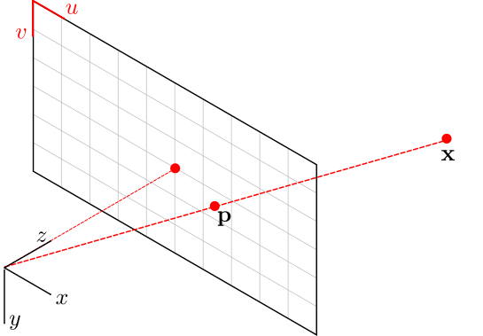
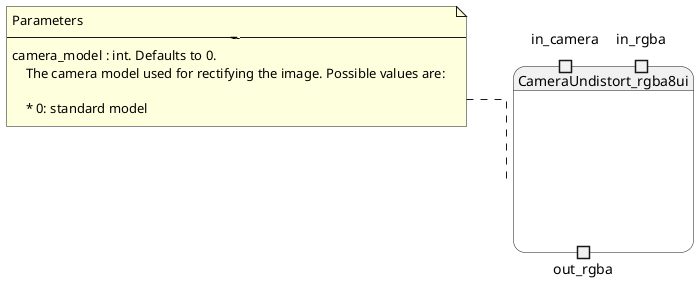


A Jupyter notebook with the code in this article is available in [Google Colab](https://colab.research.google.com/drive/1ZCuY7E904K7IdsI0FW2O13H_bYn-2LYJ?usp=sharing). Check it out!


## Background

Camera undistort is the process by which distortions generated by the optics used in the camera during the capture process are corrected in software. The process requires a mathematical model of the distortion, and a calibration procedure to estimate the parameters of such model given actual images.

An overview of the camera modeling is pressented in the Computer Vision book of [Szeliski][8] and the Multiple View Geometry book of [Hartley and Zisserman][9], as well as the articles of [Zhang][6], [Wei and Ma][7].

There are several calibration toolboxes available for estimating the camera model from a series of images:

* [OpenCV calibration routines][1].
* [Matlab camera calibration App][2].

Any of such frameworks can be used to estimate the camera model parameters. Those parameters are the input to the undistort method presented in this article to rectify raw captured images.

### Camera model

The figure below illustrates the camera model.

The 3D point $\mathbf{x} \in \mathbb{R}^3$ is expressed relative to the camera body fixed frame. It projects onto the camera image plane as pixel $\mathbf{p} := (u, v)^\top \in \mathbb{R}^2$ as

$$
\begin{equation}
\begin{pmatrix}
    \mathbf{p} \\\
    1
\end{pmatrix} := \begin{pmatrix}
    u \\\
    v \\\
    1
\end{pmatrix} = \frac{\mathbf{K} \mathbf{x}}{ \left< e_3, \mathbf{x} \right>}
\end{equation}
$$

where $\mathbf{K} \in \mathbb{R}^{3\times3}$ is the camera intrinsics matrix, $e_3 := (0, 0, 1)^\top$, and $\left< e_3, \mathbf{x} \right>$ is the dot product between the two vectors. The units of $\mathbf{p}$ are actual pixel coordinates in the ranges $u \in [0, W)$ and $v \in [0, H)$, with $W$ and $H$ denoting the image width and height respectively.

Given a pixel point, the corresponding 3D coordinate $\bar{\mathbf{x}}$ in the image plane is defined as:

$$
\begin{equation}
\bar{\mathbf{x}} := \begin{pmatrix}
\bar{x} \\\
\bar{y} \\\
\bar{z} \\\
\end{pmatrix} = \mathbf{K}^{-1} \begin{pmatrix}
    \mathbf{p} \\\
    1
\end{pmatrix}
\end{equation}
$$


Notice that this projection does return $\bar{\mathbf{x}}$ and not the original 3D point $\mathbf{x}$. To return the actual 3D position in the world, the depth information is needed to project $\bar{\mathbf{x}}$ outside of the image plane to the world.


### Standard distortion model

The standard distortion model is formed by two components:

* A **radial** component parameterized by three coefficients: $k_1$, $k_2$, and $k_3$.
* A **tangential** component with two parameters: $p_1$ and $p_2$.

The radial distortion component for a given pixel $\mathbf{p}$ is computed as

$$
\begin{equation}
\bar{\mathbf{x}}_r :=
R \begin{pmatrix}
  \bar{x} \\\
  \bar{y} \\\
  0
\end{pmatrix}
\end{equation}
$$

where $R \in \mathbb{R}$ is

$$
\begin{equation}
R = k_1 r^2 + k_2 r^4 + k_3 r^6 
\end{equation}
$$

with

$$
\begin{equation}
r^2 = \bar{x}^2 + \bar{y}^2
\end{equation}
$$

and $\bar{x}, \bar{y}$ are the $x$ and $y$ coordinates of the projection of pixel $\mathbf{p}$ using equation (2).

The tangential distortion is computed as:

$$
\begin{equation}
\bar{\mathbf{x}}_p :=
\begin{pmatrix}
  2 p_1 \bar{x}\bar{y} + p_2(r^2 + 2\bar{x}^2) \\\
  p_1(r^2 + 2 \bar{y}^2) + 2 p_2 \bar{x}\bar{y} \\\
  0
\end{pmatrix}
\end{equation}
$$

Finally, the undistorted image plane coordinates $\bar{\mathbf{x}}_u$ is computed as:

$$
\begin{equation}
\bar{\mathbf{x}}_u = \bar{\mathbf{x}} + \bar{\mathbf{x}}_r + \bar{\mathbf{x}}_p
\end{equation}
$$

Given $\bar{\mathbf{x}}_u$, the corresponding undistorted pixel coordinate is:

$$
\begin{equation}
\begin{pmatrix}
    \mathbf{p}_u \\\
    1
\end{pmatrix} := \begin{pmatrix}
    u_u \\\
    v_u \\\
    1
\end{pmatrix} = \frac{\mathbf{K} \bar{\mathbf{x}}_u}{ \left< e_3, \bar{\mathbf{x}}_u \right>}
\end{equation}
$$


The convention for the tangential parameters $p_1$ and $p_2$ is the same to that of OpenCV. However, this convention is flipped to respect to that presented in the article of *Wei and Ma*.


The figures below illustrate the effects of the radial and tangential distortion. A possitive value of $k_1$ creates a **barrel** effect, while a negative value generates a **pincushion** effect. For the tangential parameters, $p_1$ models missalignment between the image sensor and the image plane in the $y$ axis, while $p_2$ models such missalignment in the $x$ axis.













## Implementation

The camera undistort procedure is implemented as a single **ComputeNode** with the following interface:

The node explicitly requires `rgba8ui` images to be bound to the node. The output `out_rgba` is allocated by the node. The `in_camera` is a **`UniformBuffer`** storing the camera model. This model is defined by the `ll_camera` struct in GLSL as:



struct ll_camera {

    // The camera intrinsic matrix. Used to project 3D points expressed in the camera coordinate frame
    // to the image plane and convert to pixel coordinates.
    mat3 K;

    // The inverse camera intrinsic matrix. Used to convert from pixel to image plane coordinates.
    mat3 Kinv;

    // Radial distortion coefficients. For the standard camera model,
    // only the first 3 coefficients are used (XYZ).
    vec4 radialDistortion;

    // Tangential distortion coefficients. Only the first 2 coefficients are used (XY).
    vec4 tangentialDistortion;
};



Uniform buffers are a special type of buffers used to store small data structures used in graphics and compute pipelines. The Vulkan tutorial on Uniform Buffers is a [good read][3] on how they are used in general. Notice that the `ll_camera` uses GLSL types such as `mat3` and `vec4`. In the host CPU, one must use corresponding types and follow the byte alignmnet rules to make the buffer usable in the GPU. The alignment rules are defined by the **`STD140`** [layout rules][4]. For the `ll_camera` struct, the `mat3` attributes must be transferred as a matrix of 4 rows and 3 columns in order to meet the alignment requirements.


In GLSL, matrices are stored in **column-major** order. For a given matrix `M` indexed as `M[i, j]` where `i` and `j` are the row and column indexes, respectively, the elements `M[i, j]` and `M[i, j+1]` are stored contiguously in memory. This is different, for instance, to numpy's default ordering as **row-major**.  


The code block below shows a complete example on how to run the `lluvia/camera/CameraUndistort_rgba8ui` node using a dummy camera model with radial and tangential distortion:



import lluvia as ll
import lluvia.util as ll_util
import numpy as np
import matplotlib.pyplot as plt

session = ll.createSession()

# memory to store the input and output images
memory = session.createMemory(ll.MemoryPropertyFlagBits.DeviceLocal)

# memory to store the uniform buffer with the camera parameters
host_memory = session.createMemory([ll.MemoryPropertyFlagBits.DeviceLocal,
                                    ll.MemoryPropertyFlagBits.HostVisible,
                                    ll.MemoryPropertyFlagBits.HostCoherent])

# read a sample image
sampleImage = ll_util.readSampleImage('koala')

# draw a grid on top of the sample image
Yrange = np.arange(0, sampleImage.shape[0], 128)
Ylines = np.concatenate([n + Yrange for n in range(4)])

Xrange = np.arange(0, sampleImage.shape[1], 128)
Xlines = np.concatenate([n + Xrange for n in range(4)])

sampleImage[Ylines, ...] = 0
sampleImage[:, Xlines, ...] = 0

# the input image view must be sampled. This example uses nearest neighbor interpolation
in_rgba = memory.createImageViewFromHost(sampleImage,
                                         filterMode=ll.ImageFilterMode.Nearest,
                                         addressMode=ll.ImageAddressMode.Repeat,
                                         normalizedCoordinates=False,
                                         sampled=True)

###################################################
# Camera parameters
W = float(in_rgba.width)
H = float(in_rgba.height)

# Dummy camera matrix
K = np.array([[W, 0, 0.5*(W -1)],
              [0, H, 0.5*(H -1)],
              [0, 0, 1] ], dtype=np.float32, order='F')
Kinv = np.linalg.inv(K)
radialDistortion = np.array([0.5, 0, 0, 0,], dtype=np.float32)
tangentialDistortion = np.array([0.1, 0, 0, 0], dtype=np.float32)

# align the matrices according to the STD140 rules (column major, 4-component vectors)
K_aligned = np.zeros((4,3), dtype=np.float32, order='F'); K_aligned[:3, :3] = K
Kinv_aligned = np.zeros((4,3), dtype=np.float32, order='F'); Kinv_aligned[:3, :3] = Kinv

# create bytes buffer from matrices
buf = K_aligned.tobytes(order='F') + Kinv_aligned.tobytes(order='F') + radialDistortion.tobytes() + tangentialDistortion.tobytes()
npBuf = np.frombuffer(buf, dtype=np.uint8)

# in_camera uniform buffer
in_camera = host_memory.createBufferFromHost(npBuf, usageFlags=[ll.BufferUsageFlagBits.TransferSrc,
                                                                ll.BufferUsageFlagBits.TransferDst,
                                                                ll.BufferUsageFlagBits.UniformBuffer])

###################################################
# Compute node
CameraUndistort = session.createComputeNode('lluvia/camera/CameraUndistort_rgba8ui')
CameraUndistort.setParameter('camera_model', ll.Parameter(1)) # standard model
CameraUndistort.bind('in_rgba', in_rgba)
CameraUndistort.bind('in_camera', in_camera)
CameraUndistort.init()

CameraUndistort.run()

out_rgba = CameraUndistort.getPort('out_rgba')

###################################################
# Plotting
fig = plt.figure(figsize=(15, 8)); fig.set_tight_layout(True)
plt.subplot2grid((1,2), (0,0)); plt.imshow(in_rgba.toHost()[..., :3]); plt.title('in_rgba')
plt.subplot2grid((1,2), (0,1)); plt.imshow(out_rgba.toHost()[..., :3]); plt.title('out_rgba')
plt.show()



Lines 36 to 60 create the uniform buffer containing the camera model. Lines 42 and 45 create the camera intrinsics matrix `K` and its inverse `Kinv`. Then, in lines 50-51, those matrices are aligned to meet the `std140` requirements; in this case, storing each matrix in a 4x3 matrix in column-major ordering (using `order='F'` in numpy). Finally, lines 54-55 concatenates all camera parameters to create a single numpy array `npBuf` which is then used to create the `in_camera` uniform buffer in lluvia.




## Runtime performance

A Razer Blade laptop running Ubuntu 22.04LTS was used for the runtime analysis. The laptop is equipped with an Intel i7-11800H processor, and the following Vulkan devices as reported by the code block below:



import lluvia as ll
for dev in ll.getAvailableDevices():
    print(dev)



* NVIDIA GeForce RTX 3070 Laptop GPU.
* Intel(R) UHD Graphics (TGL GT1).
* llvmpipe (LLVM 13.0.1, 256 bits). This is a CPU implementation of the Vulkan API shipped with the [Mesa drivers][5].

In addition, the `cv2.undistort()` function from OpenCV is considered for reference. Five resolutions are used in the evaluation: `VGA 640x480`, `HD 1280x720`, `FHD 1920x1080`, `WQHD 2560x1440`, and `UHD 3840x2160`. For each resolution, the algorithm is run for 1000 iterations and the median runtime is extracted. The figure and table belows show the runtime for each device and resolution combination.




|Resolution     | Device name        |   Runtime median ms |
|:--------------|:-------------------|--------------------:|
|VGA 640x480    | Intel UHD Graphics |        0.00235      |
|               | RTX 3070           |        0.013888     |
|               | llvmpipe           |        0.604263     |
|               | OpenCV             |        2.04252      |
|HD 1280x720    | Intel UHD Graphics |        0.007734     |
|               | RTX 3070           |        0.03728      |
|               | llvmpipe           |        1.50221      |
|               | OpenCV             |        6.38165      |
|FHD 1920x1080  | Intel UHD Graphics |        0.0151045    |
|               | RTX 3070           |        0.07456      |
|               | llvmpipe           |        3.17916      |
|               | OpenCV             |       17.1453       |
|WQHD 2560x1440 | Intel UHD Graphics |        0.0262145    |
|               | RTX 3070           |        0.109344     |
|               | llvmpipe           |        5.97528      |
|               | OpenCV             |       22.8469       |
|UHD 3840x2160  | Intel UHD Graphics |        0.058583     |
|               | RTX 3070           |        0.242688     |
|               | llvmpipe           |       17.6178       |
|               | OpenCV             |       49.477        |


Notice that the Intel UHD Graphics device reports lower runtime than the discrete Nvidia RTX 3070 GPU. It is not clear why this is the case, as the Nvidia GPU has more compute resources than the Intel integrated graphics.


Also, notice how the **`llvmpipe`** CPU device is between three to four times faster than the **`OpenCV`** function. However, both CPU devices are 2 orders of magnitude slower than the **`Nvidia`** and **`Intel`** GPU devices. 

## Discussion

This post showed how to run the camera undistort node in Lluvia. The node takes as input an RGBA image and a camera model stored in a uniform buffer in the GPU, and produces an RGBA output image. The camera model stored in the uniform model must follow the GLSL std140 layout rules. In terms of runtime performance, the GPU implementation is several orders of magnitude faster than the OpenCV default implementation.

Future pieces of work includes:

* Expose the interpolation coordinates for undistorting the images as a new compute node. These coordinates could be cached in order to save computations on every node invocation.
* Clip the undistorted image to a given area according to the camera model. This will be useful to avoid wasted pixels in the output, as shown in the examples. 
* Support for more image formats, such as `r8ui` and floating point channel types.

## References

* [OpenCV camera calibration routines][1].
* [Matlab calibration app][2].
* [Vulkan tutorial on Uniform Buffers][3].
* [GLSL STD140 memory layout][4].
* [Mesa llvmpipe][5].
* Zhang, Z., 2000. A flexible new technique for camera calibration. IEEE Transactions on pattern analysis and machine intelligence, 22(11), pp.1330-1334. [Microsoft Technical Report][6].
* Wei, G.Q. and De Ma, S., 1994. Implicit and explicit camera calibration: Theory and experiments. IEEE Transactions on Pattern Analysis and Machine Intelligence, 16(5), pp.469-480. [DOI][7].
* Szeliski, R., 2010. Computer vision: algorithms and applications. Springer Science & Business Media. [Book][8].
* Hartley, R. and Zisserman, A., 2003. Multiple view geometry in computer vision. Cambridge university press. [Book][9]

[1]: https://docs.opencv.org/4.x/dc/dbb/tutorial_py_calibration.html
[2]: https://www.mathworks.com/help/vision/ref/cameracalibrator-app.html
[3]: https://vulkan-tutorial.com/Uniform_buffers/Descriptor_layout_and_buffer
[4]: https://www.khronos.org/opengl/wiki/Interface_Block_(GLSL)
[5]: https://docs.mesa3d.org/drivers/llvmpipe.html
[6]: https://www.microsoft.com/en-us/research/wp-content/uploads/2016/02/tr98-71.pdf
[7]: https://doi.org/10.1109/34.291450
[8]: https://szeliski.org/Book/
[9]: https://www.cambridge.org/core/books/multiple-view-geometry-in-computer-vision/0B6F289C78B2B23F596CAA76D3D43F7A
