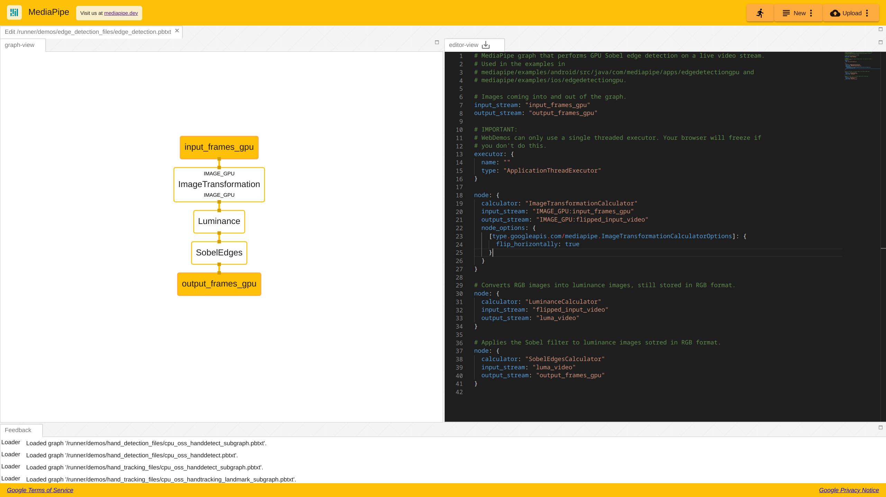
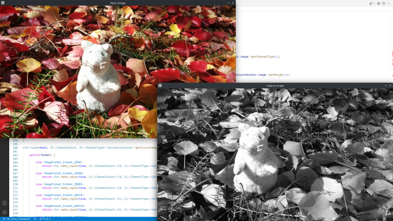
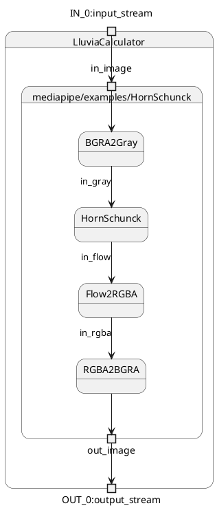

## Introduction

[Mediapipe][1] is a cross-platform framework to create complex Computer Vision pipelines both for offline and real-time applications. It leverages popular frameworks such as OpenCV and Tensorflow to process audio, video, and run deep learning models. By integrating Lluvia into mediapipe, it is possible to speed up some of those computations by creating a GPU compute pipeline.




Mediapipe is a more general framework than Lluvia. Mediapipe, at its core, is a compute graph scheduler, where each node can contain any arbitrary processing logic. The integration of third-party frameworks (e.g. OpenCV, Tensorflow, Lluvia) gives the framework its power for developing complex Computer Vision pipelines.

Lluvia, on the other hand, is specialized in creating compute pipelines running efficiently on GPU. Bringing the project to Mediapipe will enable easier integration with other frameworks and increase runtime performance of Computer Vision applications.


### On Graphs, Calculators and Packets

Mediapipe uses **Directed Acylic Graphs** to describe the compute pipeline to be run by the framework. Each node in the graph is denoted a **Calculator**. Each calculator declares its inputs and outputs contract, establishing the type of **packet** it can handle, and defines a function to process those packets.

Graphs are described as Protobuffers, with the configuration for each calculator. Mediapipe takes this data at runtime, instantiate each calculator, and connects it to its up and downstream neighbors according to the supplied contracts.

Packets enter the graph through **input streams** and leave it through **output streams**. When a new packet arrives, mediapipe schedules the processing of that packet to the corresponding calculator, or enqueues it if it is busy.

The figure below illustrates a mediapipe graph for performing [edge detection on the GPU](https://viz.mediapipe.dev/demo/edge_detection). Each calculator receives GPU image packets and schedules execution on the available device.




A packet in Mediapipe is an independent piece of data that travels through the calculator graphs. This enables Mediapipe to schedule running several calculators concurrently, thus potentially increasing performance.

In Lluvia, nodes connected through inputs and outputs do not allocate new memory on each run of the node. Instead, all the memory is allocated at node initialization time, and exposed through the node's ports. Then, the whole graph is scheduled to run on the GPU device in one go. This reduces the delay in computations as avoids cross-talk between the host CPU and the GPU to synchronize individual node execution.


## Lluvia as a mediapipe dependency

Mediapipe, as well as Lluvia, are built using [Bazel][3]. As a consequence, the integration of Lluvia can be done by including the project as a Bazel dependency into Mediapipe repository.
The current approach to achieve this is through the use of an auxiliary repository, [**lluvia-mediapipe**][2], that contains the **LluviaCalculator** node to run GPU compute-pipelines as a Mediapipe calculator. The build instructions are available in the [mediapipe integration guide](/docs/gettingstarted/mediapipe_integration/). The process is as follows:

1. Clone Mediapipe repository alongside Lluvia.
2. Configure Mediapipe's Bazel workspace to build in your host machine.
3. Include Lluvia as a dependency to Mediapipe.
4. Clone `lluvia-mediapipe` repository inside Mediapipe to enable building its targets.
5. Run the tests included in the repository to validate the build.

The directory structure of the three projects should look like this:

```
lluvia                          <-- lluvia repository
mediapipe                       <-- mediapipe repository
├── BUILD.bazel
├── LICENSE
├── ...
├── mediapipe                   <--
│   ├── BUILD
│   ├── calculators
│   ├── examples
│   ├── framework
│   ├── gpu
│   ├── ...
│   ├── lluvia-mediapipe        <-- lluvia-mediapipe repository
├── ...
├── .bazelrc
└── WORKSPACE
```

Once Mediapipe builds correctly, it is possible to create graphs that include the `LluviaCalculator`.

## The **`LluviaCalculator`**

The **`LluviaCalculator`** is in charge of initializing Lluvia, binding input and output streams from mediapipe to lluvia ports, and running a given compute pipeline.
The figure below illustrates a basic mediapipe graph utilizing lluvia, while the code below shows the graph description using Protobuffer text syntax:


```proto
input_stream: "input_stream"
output_stream: "output_stream"

node: {
  calculator: "LluviaCalculator"
  input_stream: "IN_0:input_stream"
  output_stream: "OUT_0:output_stream"
  node_options {
      [type.googleapis.com/lluvia.LluviaCalculatorOptions]: {
          enable_debug: true
          library_path: "path to .zip node library file"
          script_path: "path to .lua script defining the main container node"
          container_node: "mediapipe/examples/Passthrough"
          input_port_binding:  {
              mediapipe_tag: "IN_0"
              lluvia_port: "in_image"
          }
      }
  }
}
```

where:

1. The `enable_debug` flag tells whether or not the Vulkan debug extensions used by Lluvia should be loaded during session creation. This flag might be set to `false` in production applications to improve runtime performance.
2. The `library_path` declare paths to node libraries (a `.zip` file) containing Lluvia nodes (Container and Compute). This attribute can be repeated several times.
3. The `script_path` is the path to a `lua` script declaring a `ContainerNode` that Lluvia will instantiate as the "main" node to run inside the calculator.
4. `input_port_binding`, maps mediapipe input tags to the main `ContainerNode` port. In the example above, mediapipe's input tag `IN_0` is mapped to lluvia's `in_image` port.

## Examples

`lluvia-mediapipe` includes two applications, **`single_image`** and **`webcam`** to run on the host system. The `single_image` app, as the name suggests, reads the content of a single image and feeds it to a Mediapipe graph.

The command below executes the binary with a graph configured to run the [`lluvia/color/BGRA2Gray` compute node](/nodes/lluvia/color/bgra2gray) to convert from the BGRA input to gray scale:

```bash
bazel run --copt -DMESA_EGL_NO_X11_HEADERS --copt -DEGL_NO_X11 \
    //mediapipe/lluvia-mediapipe/examples/desktop/single_image:single_image -- \
    --input_image=${HOME}/git/lluvia/lluvia/resources/mouse.jpg \
    --script_file=${HOME}/git/mediapipe/mediapipe/lluvia-mediapipe/examples/desktop/graphs/BGRA2Gray/script.lua \
    --graph_file=${HOME}/git/mediapipe/mediapipe/lluvia-mediapipe/examples/desktop/graphs/BGRA2Gray/graph.pbtxt
```

where `${HOME}/git` is the base folder where Lluvia and Mediapipe are cloned. Change this according to your setup.



A more sophisticated example is running the [Horn and Schunck optical flow](/blog/2022/08/07/implementing-the-horn-and-schunck-optical-flow-algorithm) algorithm inside of Mediapipe. The `webcam` binary opens the default capture device using OpenCV and transfers the captured frames the compute graph. The graph is a single `LluviaCalculator` running several nodes:

```bash
bazel run --copt -DMESA_EGL_NO_X11_HEADERS --copt -DEGL_NO_X11 \
    //mediapipe/lluvia-mediapipe/examples/desktop/webcam:webcam -- \
    --script_file=${HOME}/git/mediapipe/mediapipe/lluvia-mediapipe/examples/desktop/graphs/HornSchunck/script.lua \
    --graph_file=${HOME}/git/mediapipe/mediapipe/lluvia-mediapipe/examples/desktop/graphs/HornSchunck/graph.pbtxt
```

where `--graph_file=${HOME}/git/mediapipe/mediapipe/lluvia-mediapipe/examples/desktop/graphs/HornSchunck/graph.pbtxt` is the path to Mediapipe's graph to be run by the app, and `--script_file=${HOME}/git/mediapipe/mediapipe/lluvia-mediapipe/examples/desktop/graphs/HornSchunck/script.lua` points to a Lua script defining the Container node to run inside of the `LluviaCalculator`.



First, the input image is transformed from BGRA color space to gray scale. Next, the images are fed to the [**`HornSchunck`** container node](/nodes/lluvia/opticalflow/hornschunck/hornschunck) to compute optical flow. The estimated flow is then converted to color using the [**`Flow2RGBA`** compute node](/nodes/lluvia/viz/flow2rgba), and finally, the RGBA output is converted to BGRA to proper rendering in the window opened by OpenCV.


In Mediapipe, every Calculator must be compiled and integrated into the binary at build time, thus requiring rebuilding every time a new Calculator must be added or modified.

Lluvia describes nodes as a pair of Lua and GLSL (for ComputeNode) files that are compiled and packaged into a node library as a **`.zip`** file. Once packaged, the library can be imported on any runtime where Lluvia runs. This eases the developer experience as one can develop nodes in a higher-level environment, using [Python in a Jupyter notebook](https://colab.research.google.com/drive/1SPwxUIdYxCALD0d0w7rE93EuX0fm832S?usp=sharing) for instance, package the nodes in a node library and then use them in any environment (Mediapipe for instance).



## Discussion

This article presented the integration of Lluvia into the Mediapipe project. By added the project into Mediapipe, it is possible to leverage the GPU compute-pipeline capabilities of Lluvia to speed up parts of complex Computer Vision applications.

The integrations between thw two projects is achieved through the **`LluviaCalculator`** which runs any arbitrary `ContainerNode`. This calculator is in early stages of development, and feedback is very welcomed. Some immediate improvements include:

1. Support `GPUImageFrame` input and output packets. Currently, the calculator only accepts CPU `ImageFrame` packets, thus introducing some latency while copying data from CPU memory space to the GPU.
2. Support Mediapipe side packets to send configuration updates to the calculator.
3. Include more configuration attributes (e.g. node parameters) in the Protobuffer type.

And finally, testing the integration in other platforms such as Android.

## References

* [Mediapipe][1]
* [lluvia-mediapipe][2]
* [Bazel][3]

[1]: https://mediapipe.dev/
[2]: https://github.com/jadarve/lluvia-mediapipe
[3]: https://bazel.build/
