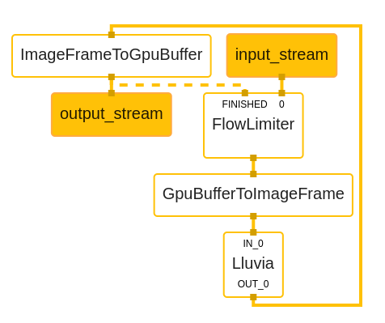

## Introduction

The [previous post on mediapipe integration]() explored how to integrate Lluvia with Mediapipe to create complex Computer Vision pipelines leveraging mediapipe's integration with other frameworks such as OpenCV and Tensorflow. This post expands this integration to run Lluvia on Android systems.

The video below shows the [Optical Flow Filter algorithm](https://doi.org/10.1109/LRA.2016.2532928) running on a Samsung Galaxy S22+ phone.



## Graph for mobile applications

The figure below illustrates the pipeline used on Android for running the **`LluviaCalculator`**. First, a `FlowLimiter` calculator receives the images from the `input_stream`. This calculator controls the rate at which packets are sent downstream; it receives an additional input from the last calculator, `ImageFrameToGpuBuffer`, that indicates processing has been completed and that a new packet can be received.

The `GpuBufferToImageFrame` and `ImageFrameToGpuBuffer` calculators convert packets from `GpuBuffer` to `ImageFrame` and vice-versa. They are needed for two reasons:

1. On Android, the `input_stream` and `output_stream` ports of the pipeline expect `GpuBuffer` types.
2. Currently, the `Lluvia` calculator cannot handle `GpuBuffer` packets.

Finally, the `Lluvia` calculator runs the configured GPU pipeline. 




Support for transferring data to and from `GpuBuffer` packets in the `LluviaCalculator` is planned. This will avoid the use of `GpuBufferToImageFrame` and `ImageFrameToGpuBuffer` calculators, thus reducing the memory copy overhead.



## Android application

The [mediapipe repository](https://github.com/google/mediapipe) provides examples on how to build Android applications that run the framework. The dataflow is as follows:

1. In Java/Kotlin, configure the app to open the camera. [Camera2](https://developer.android.com/training/camera2) or [CameraX](https://developer.android.com/training/camerax) APIs can be used.
2. Camera frames are received on Surface objects, opaque objects that hold reference to the image pixel data.
3. The surface objects are transferred to the mediapipe graph, entering through the `input_stream`. In there, the packets are sent as `GpuBuffer` to be consumed by the calculators.
4. The graph execution takes place, and the output packets are received by the application through the `output_stream`. The `GpuBuffer` packets are transformed to Android surface objects.
5. The surface objects are rendered in the screen.


### Mediapipe Android archive


The [mediapipe integration guide]() includes new instructions on how to configure the project to support Android builds. 


Apps can consume medipipe libraries through Android Archive files (AAR). Archives are a special type of library containing JVM classes, assets, and native libraries (compiled for x86, arm64, or other architectures). Archives can be imported to the app either by placing them within the app source tree, or by declaring a dependency to a remote repository (e.g. Maven).

Mediapipe bazel rules include targets to build AAR files than be used on Android. The `lluvia-mediapipe` repo uses these rules to compile an archive that compiles lluvia along with mediapipe, and export all the required assets (node library, scripts and graphs). The AAR is created by running:

```bash
bazel build \
    -c opt \
    --host_crosstool_top=@bazel_tools//tools/cpp:toolchain \
    --fat_apk_cpu=arm64-v8a \
    //mediapipe/lluvia-mediapipe/java/ai/lluvia:lluvia_aar
```

where `--fat_apk_cpu=arm64-v8a` defines the CPU architectures that the native code will be compiled to. The archive is available at:

```
bazel-bin/mediapipe/lluvia-mediapipe/java/ai/lluvia/lluvia_aar.aar
```

which can directly be copied to the App's libraries, or exported to a remote repository.

## Discussion

This post explained how to use Mediapipe to run Lluvia compute pipelines on Android systems. The mobile graph uses the `FlowLimiter` calculator to control the rate at which image packets are consumed by the pipeline. Future work includes:

* Support `GpuBuffer` input and output packets in the `Lluvia` calculator.
* Fully working Android code example.
* Use the [Android GPU Inspector](https://developer.android.com/agi/) to profile the performance of the app.
