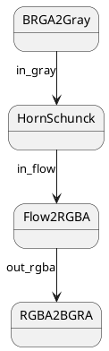

## Introduction

The Raspberry Pi 4 project announced back in [November 2020](https://www.raspberrypi.com/news/vulkan-update-were-conformant/) that the Vulkan 1.0 conformance tests successfully passed for its GPU driver. More recently in [August 2022](https://www.raspberrypi.com/news/vulkan-update-version-1-2-conformance-for-raspberry-pi-4/), Vulkan 1.2 conformance testing has been completed.

The conformance tests are a large set of tests run against a driver implementation to see if it conforms with the Vulkan specification. This is essential to maintain the Vulkan API portable across platforms and GPU vendors.

In addition, LunarG announced [support of the Vulkan SDK on the Raspberry Pi 4](https://www.linkedin.com/posts/lunarg-inc-_lunargs-vulkan-sdk-for-linux-now-builds-activity-6968566164138459136-Dw4Y?utm_source=share&utm_medium=member_desktop). With this, the two most important requirements to build Lluvia on the RPi4 became available.


The build instructions are available in the [Getting started page](). They can be summarized as:

* Prepare the operating system.
* Build the Vulkan SDK following the [official documentation](https://vulkan.lunarg.com/doc/sdk/1.3.224.1/linux/getting_started.html).
* Build and install OpenCV (for running demos).
* Install Bazel.
* Build and install Lluvia.


## Optical flow demo

There is a new demo shipped with the Lluvia source code to run pipelines with images captured from a camera. Currently, the demo uses [OpenCV VideoCapture class](https://docs.opencv.org/4.5.5/d8/dfe/classcv_1_1VideoCapture.html) to capture images from the Raspberry camera module.



The demo app, which can be run from the repository root folder as

```shell
./samples/webcam/webcam.py --width=320 --height=240 \
  ./samples/webcam/scripts/horn_schunck.lua webcam/HornSchunck
```

configures the camera to capture images at `320x240` resolution and runs the `webcam/HornSchunck` container node defined in the `horn_schunck.lua` script. The container node creates the pipeline illustrated below:



with the [**`HornSchunck`**]() node containing the algorithm implementation as discussed in a [previous article](). 


By default, OpenCV used **BGRA** channel ordering for color images. On the other hand, Lluvia uses **RGBA** ordering to store color images. The last node in the demo pipeline converts to the color order OpenCV expects to render into the screen. 



## Discussion

This post introduced the instructions for building Lluvia on the Raspberry Pi 4. A new demo application for running pipelines with images captured from the Pi's camera module is also presented.

As of now, Lluvia is supported in four platforms:

* Linux x86_64.
* Windows.
* Android through the [mediapipe integration]().
* Raspberry Pi 4.

Future work can include support for other platforms such as:

* Nvidia Jetson hardware.
* MacOS and iOS.

With these many platforms, an interesting topic for future work is running benchmarks across all of them for assessing the runtime performance of different computer vision algorithms. 
