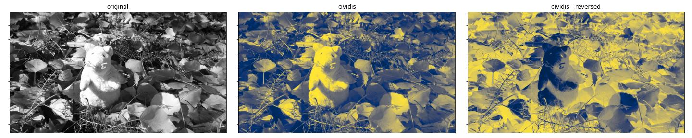
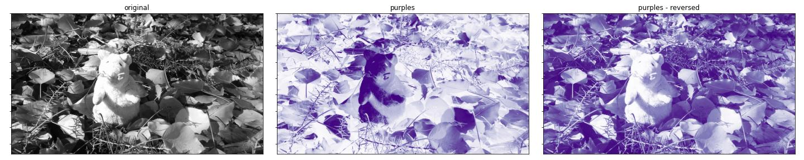
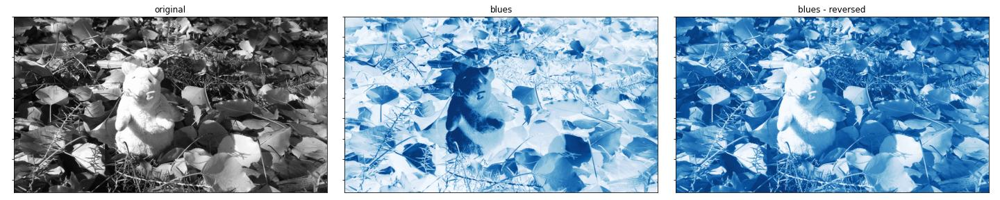
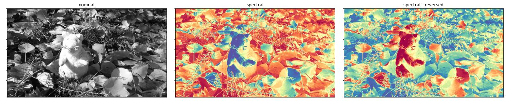
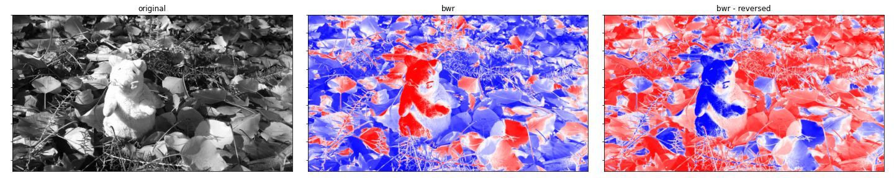

## Introduction

Data visualization is an important tool for developing new algorithms. For 2D data in particular, it is possible to visualize the data as colored images.

## Color mapping

Let $F : \mathbb{Z}^{2}_{\ge 0} \rightarrow \mathbb{R}$ be a scalar field defined for $(x, y)$ in the set of integer numbers greater or equal zero (standard image coordinates). The value $F(x, y)$ on each point is an element of the real numbers $\mathbb{R}$.

Next, let $c(z) : \mathbb{R} \rightarrow \text{RGB}$ be a color mapping function converting from a real value $z$ to RGB color space. In practice, the color output of $c(z)$ must be in a closed range that enables visualization in a computer screen. Constraining each color component to lie in the range $[0, 255]$ is common. This can be achieved by limiting the range of the input $z$ to values in the interval $[0, 1]$, that is:

$$
\bar{z} = \frac{z}{z_\text{max} - z_\text{min}}
$$

where $z_\text{min}$ and $z_\text{max}$ are known values.

The color field $C : \mathbb{Z}^{2}_{\ge 0} \rightarrow \text{RGB}$ is the result of applying the color mapping function of all values of field $F$ as:

$$
C(x, y) := c\left\( \frac{F(x, y)}{z_\text{max} - z_\text{min}} \right\)
$$

### Gray color mapping

A simple color mapping function is the one mapping to gray scale values. $c_\text{gray}(z)$ is defined as:

$$
c_\text{gray}(\bar{z}) = 255 (\bar{z}, \bar{z}, \bar{z}) 
$$

That is, creating a 3-vector of the normalized input value repeated in each color component and multiplying it by 255 to obtain an RGB color.


### Complex color mappings

**TODO:** talk about matplotlib colormaps.

## Colormap nodes

There are four new nodes available in Lluvia for color mapping:

```
lluvia/viz/colormap/ColorMap             : Container : Maps a scalar field to a color field using a color map.
lluvia/viz/colormap/ColorMap_float       : Compute   : Maps a floating point scalar field to a color field using a color map.
lluvia/viz/colormap/ColorMap_int         : Compute   : Maps an integer scalar field to a color field using a color map.
lluvia/viz/colormap/ColorMap_uint        : Compute   : Maps an unsigned integer scalar field to a color field using a color map.
```

`ColorMap_float`, `ColorMap_int`, and `ColorMap_uint` process input fields of `float`, `int`, and `uint` types respectively. They are aggregated by the `ColorMap` container node (no suffix), which instantiates one of the others according to the input image type.

The interface of `ColorMap` is:

* **Parameters:**
    * `color_map`: string. Defaults to "viridis".
    * `min_value`: float. Defaults to 0.0. Minimum input value.
    * `max_value`: float. Defaults to 1.0. Maximum input value.
    * `alpha` : float. Defaults to 0.0. The alpha value of the output image in range [0, 1].
    * `reverse`: float. Defaults to 0.0. If 1.0, the color map is reversed.
* **Inputs:**
    * `in_image` : ImageView. {r8ui, r16ui, r32ui, r8i, r16i, r32i r16f, r32f} image. Input image.
* **Outputs:**
    * `out_image` : ImageView. rgba8ui image. The encoded color of the optical flow field.

**TODO:** Sample usage

## Available color maps

Below is the list of available color maps to choose from. These color maps are extracted from [Matplotlib](https://matplotlib.org/stable/tutorials/colors/colormaps.html) and stored in the `Colormap` node of Lluvia. The Appendix section provides the script to extract the color map data.

### Perceptually uniform maps

#### viridis


#### plasma


#### inferno


#### magma


#### cividis




### Sequential maps

#### gray


#### purples



#### blues



#### greens


#### oranges


#### reds


### Diverging maps

#### spectral



#### coolwarm


#### bwr



#### seismic


### Cyclic maps

#### twilight


#### hsv


## Discussion


## Appendix

### Color map extraction from matplotlib

```python
import numpy as np
import matplotlib as mpl
import base64

colormap_names = ['viridis', 'plasma', 'inferno', 'magma', 'cividis', 'gray', 'Purples', 'Blues', 'Greens', 'Oranges', 'Reds', 'Spectral', 'coolwarm', 'bwr', 'seismic', 'twilight', 'hsv']

x = np.linspace(0, 1, 256)

for name in colormap_names:
    
    cmap = mpl.colormaps[name]
    RGB = cmap(x)
    
    RGBA = [[c[0], c[1], c[2], 0] for c in RGB]
    RGBA = np.ceil(np.array(RGBA) * 255).astype(np.uint8)
    
    data = RGBA.data.tobytes()
    s = str(base64.b64encode(data), 'utf-8')
    
    lua_str = "builder.colorMaps['{0}'] = '{1}'".format(name.lower(), s)
    print(lua_str)
```

which produces an output similar to

```
builder.colorMaps['viridis']  = 'RQJVAEUDVgBFBFgARgZZAEYHWwBGCVwARwpdAEcMXwBHDWAARw9iAEgQYwBI...'
builder.colorMaps['plasma']   = 'DQiHABEIiAAUB4oAFgeLABkHjAAcB40AHgeOACAGjwAiBpAAJAaRACYGkgAo...'
builder.colorMaps['inferno']  = 'AQEEAAEBBQABAQcAAgEIAAICCgACAgwAAwIPAAMDEQAEAxMABQQVAAUEFwAG...'
builder.colorMaps['magma']    = 'AQEEAAEBBQABAQcAAgEIAAICCgACAgwAAwMOAAMDEAAEBBIABQQUAAUFFgAG...'
builder.colorMaps['cividis']  = 'ACNOAAAkUAAAJFEAACVTAAAmVQAAJ1YAACdYAAAoWgAAKVwAACldAAAqXwAA...'
builder.colorMaps['gray']     = 'AAAAAAEBAQACAgIAAwMDAAQEBAAFBQUABgYGAAcHBwAICAgACQkJAAoKCgAL...'
builder.colorMaps['purples']  = '/Pv9APz7/QD8+/0A+/r9APv6/AD6+fwA+vn8APr4/AD5+PsA+fj7APj3+wD4...'
builder.colorMaps['blues']    = '9/v/APf7/wD2+v8A9fr/APT5/gD0+f4A8/j+APL4/gDx9/0A8Pf9APD2/QDv...'
builder.colorMaps['greens']   = '9/z1APf89QD2/PQA9vz0APX88wD1+/IA9PvyAPT78QDz+/AA8vvwAPL67wDx...'
builder.colorMaps['oranges']  = '//XrAP/16wD/9eoA//TpAP/06AD/8+cA//PmAP/y5QD/8uQA//HjAP/x4gD/...'
builder.colorMaps['reds']     = '//XwAP/18AD/9O8A//TuAP/z7QD/8uwA//LrAP/x6gD/8OkA//DoAP/v5wD/...'
builder.colorMaps['spectral'] = 'ngFCAKEEQwCjBkQApQlEAKcLRQCpDUUAqxBGAK4SRgCwFUcAshdHALQZSAC2...'
builder.colorMaps['coolwarm'] = 'O03BADxOwgA9UMQAP1LFAEBUxwBBVcgAQlfKAENZywBEW80ARlzOAEde0ABI...'
builder.colorMaps['bwr']      = 'AAD/AAIC/wAEBP8ABgb/AAgI/wAKCv8ADAz/AA4O/wAQEP8AEhL/ABQU/wAW...'
builder.colorMaps['seismic']  = 'AABNAAAAUAAAAFMAAABVAAAAWAAAAFsAAABeAAAAYQAAAGMAAABmAAAAaQAA...'
builder.colorMaps['twilight'] = '4tnjAOHa4wDg2uIA39rhAN7a4QDc2eAA2tnfANnY3gDX190A1dfcANPW2wDQ...'
builder.colorMaps['hsv']      = '/wAAAP8GAAD/DAAA/xIAAP8YAAD/HgAA/yQAAP8qAAD/MAAA/zYAAP88AAD/...'
```
