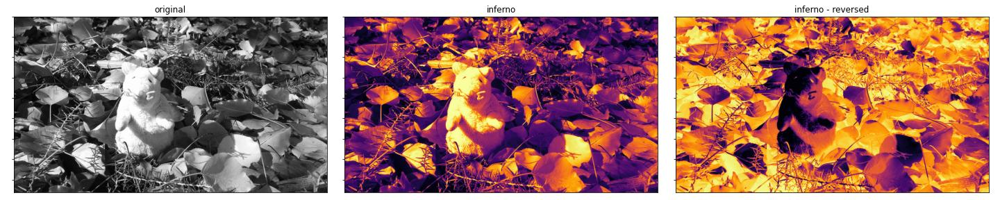
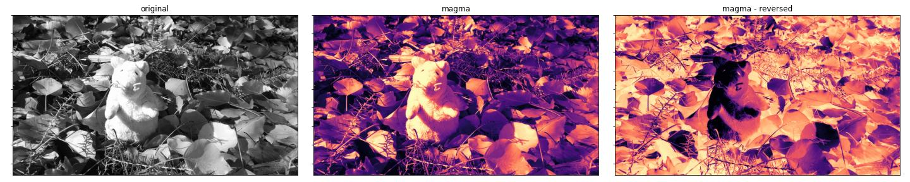
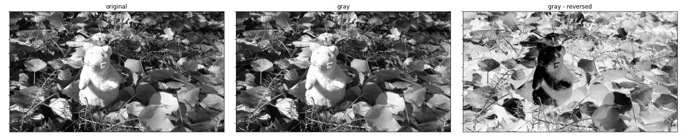
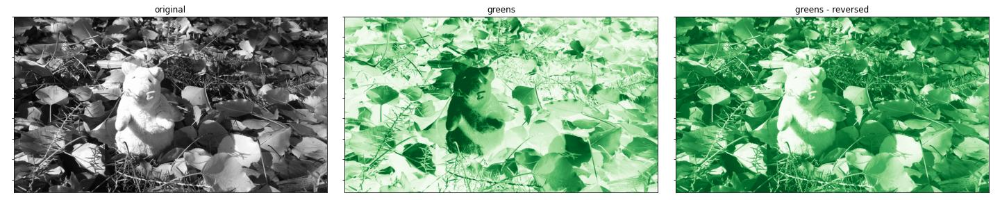
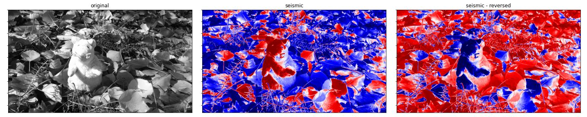
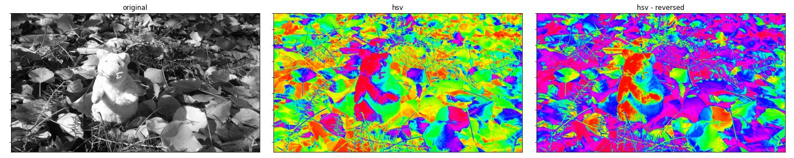


A Jupyter notebook with the code in this article is available in [Google Colab](https://colab.research.google.com/drive/147ywmmX4e5Ozvnf0DVJSqJcea26fx8jS#scrollTo=iYVTQmChletC). Check it out!


## Introduction

Data visualization is an important tool for presenting the results of new algorithms. For 2D data in particular, it is possible to visualize the data as colored images so that our brains can interpret the data in a visual way. This article presents new color mapping nodes available in Lluvia to transform 2D data into color images. These nodes use several color maps available in the [Matplotlib project][1] to accelerate data to color conversion using the GPU.

## Color mapping

Let $F : \mathbb{Z}^{2}_{\ge 0} \rightarrow \mathbb{R}$ be a scalar field defined for $(x, y)$ in the set of integer numbers greater or equal zero (standard image coordinates). The value $F(x, y)$ on each point is an element of the real numbers $\mathbb{R}$.

Next, let $c(z) : \mathbb{R} \rightarrow \text{RGB}$ be a color mapping function converting from a real value $z$ to RGB color space. In practice, the color output of $c(z)$ must be in a closed range that enables visualization in a computer screen. Constraining each color component to lie in the range $[0, 255]$ is common. This can be achieved by limiting the range of the input $z$ to values in the interval $[0, 1]$, that is:

$$
\bar{z} = \frac{z}{z_\text{max} - z_\text{min}}
$$

where $z_\text{min}$ and $z_\text{max}$ are known values.

The color field $C : \mathbb{Z}^{2}_{\ge 0} \rightarrow \text{RGB}$ is the result of applying the color mapping function of all values of field $F$ as:

$$
C(x, y) := c\left\( \frac{F(x, y)}{z_\text{max} - z_\text{min}} \right\)
$$

### Gray color mapping

A simple color mapping function is the one mapping to gray scale values. $c_\text{gray}(z)$ is defined as:

$$
c_\text{gray}(\bar{z}) = 255 (\bar{z}, \bar{z}, \bar{z}) 
$$

That is, creating a 3-vector of the normalized input value repeated in each color component and multiplying it by 255 to obtain an RGB color.


### Complex color mappings

More complex color maps have a whole set of research on color theory, human color perception and physics. Designing new color maps exclusive for Lluvia is out of scope for the project and serves little purpose as there are great color maps readily available from the open source community. In particular, since I work with Python a lot, and use [Matplotlib][1] heavily, I decided to export several of the color maps available there into Lluvia. The reader is highly encouraged to watch the presentation below from Stéfan van der Walt ([@stefanv](https://github.com/stefanv)) and Nathaniel Smith ([@njsmith](https://github.com/njsmith)) on a default perceptually uniform colormap for Matplotlib.

The following color maps are extracted from [Matplotlib](https://matplotlib.org/stable/tutorials/colors/colormaps.html) using code similar to that presented in the Appendix section:

* **Perceptually uniform maps:**
    * viridis.
    * plasma.
    * inferno.
    * magma.
    * cividis.
* **Sequential maps:**
    * gray.
    * purples.
    * blues.
    * greens.
    * oranges.
    * reds.
* **Diverging maps:**
    * spectral.
    * coolwarm.
    * bwr.
    * seismic.
* **Cyclic maps:**
    * twilight.
    * hsv.



## Colormap nodes in Lluvia

There are four new nodes available in Lluvia for color mapping:

```
lluvia/viz/colormap/ColorMap             : Container : Maps a scalar field to a color field using a color map.
lluvia/viz/colormap/ColorMap_float       : Compute   : Maps a floating point scalar field to a color field using a color map.
lluvia/viz/colormap/ColorMap_int         : Compute   : Maps an integer scalar field to a color field using a color map.
lluvia/viz/colormap/ColorMap_uint        : Compute   : Maps an unsigned integer scalar field to a color field using a color map.
```

`ColorMap_float`, `ColorMap_int`, and `ColorMap_uint` process input fields of `float`, `int`, and `uint` types respectively. They are aggregated by the `ColorMap` container node (no suffix), which instantiates one of the others according to the input image type.

The interface of `ColorMap` is:

* **Parameters:**
    * `color_map`: string. Defaults to "viridis".
    * `min_value`: float. Defaults to 0.0. Minimum input value.
    * `max_value`: float. Defaults to 1.0. Maximum input value.
    * `alpha` : float. Defaults to 0.0. The alpha value of the output image in range [0, 1].
    * `reverse`: float. Defaults to 0.0. If 1.0, the color map is reversed.
* **Inputs:**
    * `in_image` : ImageView. {r8ui, r16ui, r32ui, r8i, r16i, r32i r16f, r32f} image. Input image.
* **Outputs:**
    * `out_image` : ImageView. rgba8ui image. The encoded color of the optical flow field.


The code bellow shows how to instantiate, configure, and run the `ColorMap` node:



import lluvia as ll
import lluvia.util as ll_util
import numpy as np
import matplotlib as mpl
import matplotlib.pyplot as plt

session = ll.createSession(device=ll.getAvailableDevices()[0])

memory = session.createMemory(ll.MemoryPropertyFlagBits.DeviceLocal)
host_memory = session.createMemory([ll.MemoryPropertyFlagBits.DeviceLocal, ll.MemoryPropertyFlagBits.HostVisible, ll.MemoryPropertyFlagBits.HostCoherent])

colormap_names = ['viridis', 'plasma', 'inferno', 'magma', 'cividis', 'gray', 'purples', 'blues', 'greens', 'oranges', 'reds', 'spectral', 'coolwarm', 'bwr', 'seismic', 'twilight', 'hsv']

RGBA = ll_util.readSampleImage('mouse')

in_rgba = memory.createImageViewFromHost(RGBA, filterMode=ll.ImageFilterMode.Nearest, addressMode=ll.ImageAddressMode.Repeat, normalizedCoordinates=False, sampled=False)

RGBA2Gray = session.createComputeNode('lluvia/color/RGBA2Gray')
RGBA2Gray.bind('in_rgba', in_rgba)
RGBA2Gray.init()

RGBA2Gray.run()

img_gray = RGBA2Gray.getPort('out_gray').toHost().astype(dtype)
        
for cmap_name in colormap_names:
    
    fig = plt.figure(figsize=(20, 4)); fig.set_tight_layout(True)
    
    plt.subplot2grid((1,3), (0,0)); plt.imshow(img_gray, cmap='gray')
    plt.tick_params(axis='both', which='both', bottom=False, top=False, labelbottom=False, labelleft=False)
    plt.title('original')
    
    for i, reverse in enumerate([0, 1]):
        

        in_image = memory.createImageViewFromHost(img_gray)

        ColorMap = session.createContainerNode('lluvia/viz/colormap/ColorMap')
        ColorMap.bind('in_image', in_image)
        ColorMap.setParameter('colormap', ll.Parameter(cmap_name))
        ColorMap.setParameter('min_value', ll.Parameter(0))
        ColorMap.setParameter('max_value', ll.Parameter(255))
        ColorMap.setParameter('alpha', ll.Parameter(1.0))
        ColorMap.setParameter('reverse', ll.Parameter(reverse))
        ColorMap.init()

        ColorMap.run()

        out_rgba = ColorMap.getPort('out_rgba').toHost()
        
        plt.subplot2grid((1,3), (0, i+1)); plt.imshow(out_rgba)
        plt.tick_params(axis='both', which='both', bottom=False, top=False, labelbottom=False, labelleft=False)
        plt.title('{0}{1}'.format(cmap_name, ' - reversed' if bool(reverse) else ''))
    
    plt.show()



### Perceptually uniform maps

#### viridis


#### plasma


#### inferno



#### magma



#### cividis


### Sequential maps

#### gray



#### purples


#### blues


#### greens



#### oranges


#### reds


### Diverging maps

#### spectral


#### coolwarm


#### bwr


#### seismic



### Cyclic maps

#### twilight


#### hsv




## Appendix

### Color map extraction from matplotlib

```python
import numpy as np
import matplotlib as mpl
import base64

colormap_names = ['viridis', 'plasma', 'inferno', 'magma', 'cividis', 'gray', 'Purples', 'Blues', 'Greens', 'Oranges', 'Reds', 'Spectral', 'coolwarm', 'bwr', 'seismic', 'twilight', 'hsv']

x = np.linspace(0, 1, 256)

for name in colormap_names:
    
    cmap = mpl.colormaps[name]
    RGB = cmap(x)
    
    RGBA = [[c[0], c[1], c[2], 0] for c in RGB]
    RGBA = np.ceil(np.array(RGBA) * 255).astype(np.uint8)
    
    data = RGBA.data.tobytes()
    s = str(base64.b64encode(data), 'utf-8')
    
    lua_str = "builder.colorMaps['{0}'] = '{1}'".format(name.lower(), s)
    print(lua_str)
```

which produces an output similar to

```
builder.colorMaps['viridis']  = 'RQJVAEUDVgBFBFgARgZZAEYHWwBGCVwARwpdAEcMXwBHDWAARw9iAEgQYwBI...'
builder.colorMaps['plasma']   = 'DQiHABEIiAAUB4oAFgeLABkHjAAcB40AHgeOACAGjwAiBpAAJAaRACYGkgAo...'
builder.colorMaps['inferno']  = 'AQEEAAEBBQABAQcAAgEIAAICCgACAgwAAwIPAAMDEQAEAxMABQQVAAUEFwAG...'
builder.colorMaps['magma']    = 'AQEEAAEBBQABAQcAAgEIAAICCgACAgwAAwMOAAMDEAAEBBIABQQUAAUFFgAG...'
builder.colorMaps['cividis']  = 'ACNOAAAkUAAAJFEAACVTAAAmVQAAJ1YAACdYAAAoWgAAKVwAACldAAAqXwAA...'
builder.colorMaps['gray']     = 'AAAAAAEBAQACAgIAAwMDAAQEBAAFBQUABgYGAAcHBwAICAgACQkJAAoKCgAL...'
builder.colorMaps['purples']  = '/Pv9APz7/QD8+/0A+/r9APv6/AD6+fwA+vn8APr4/AD5+PsA+fj7APj3+wD4...'
builder.colorMaps['blues']    = '9/v/APf7/wD2+v8A9fr/APT5/gD0+f4A8/j+APL4/gDx9/0A8Pf9APD2/QDv...'
builder.colorMaps['greens']   = '9/z1APf89QD2/PQA9vz0APX88wD1+/IA9PvyAPT78QDz+/AA8vvwAPL67wDx...'
builder.colorMaps['oranges']  = '//XrAP/16wD/9eoA//TpAP/06AD/8+cA//PmAP/y5QD/8uQA//HjAP/x4gD/...'
builder.colorMaps['reds']     = '//XwAP/18AD/9O8A//TuAP/z7QD/8uwA//LrAP/x6gD/8OkA//DoAP/v5wD/...'
builder.colorMaps['spectral'] = 'ngFCAKEEQwCjBkQApQlEAKcLRQCpDUUAqxBGAK4SRgCwFUcAshdHALQZSAC2...'
builder.colorMaps['coolwarm'] = 'O03BADxOwgA9UMQAP1LFAEBUxwBBVcgAQlfKAENZywBEW80ARlzOAEde0ABI...'
builder.colorMaps['bwr']      = 'AAD/AAIC/wAEBP8ABgb/AAgI/wAKCv8ADAz/AA4O/wAQEP8AEhL/ABQU/wAW...'
builder.colorMaps['seismic']  = 'AABNAAAAUAAAAFMAAABVAAAAWAAAAFsAAABeAAAAYQAAAGMAAABmAAAAaQAA...'
builder.colorMaps['twilight'] = '4tnjAOHa4wDg2uIA39rhAN7a4QDc2eAA2tnfANnY3gDX190A1dfcANPW2wDQ...'
builder.colorMaps['hsv']      = '/wAAAP8GAAD/DAAA/xIAAP8YAAD/HgAA/yQAAP8qAAD/MAAA/zYAAP88AAD/...'
```


[1]: https://matplotlib.org/
