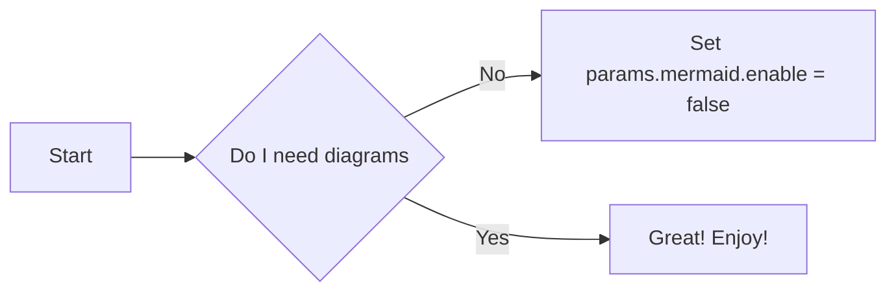

$$
    \tag*{(1)} P(E) = {n \choose k} p^k (1-p)^{n-k}
$$





  
import lluvia as ll

session = ll.createSession()


#include <lluvia/core.h>

int main() {
    auto session = ll::Session::create();

    return 0;
}



```cpp
#include <lluvia/core.h>

int main() {
    auto session = ll::Session::create();

    return 0;
}
```

```python
import lluvia as ll

session = ll.createSession()
```

moni
