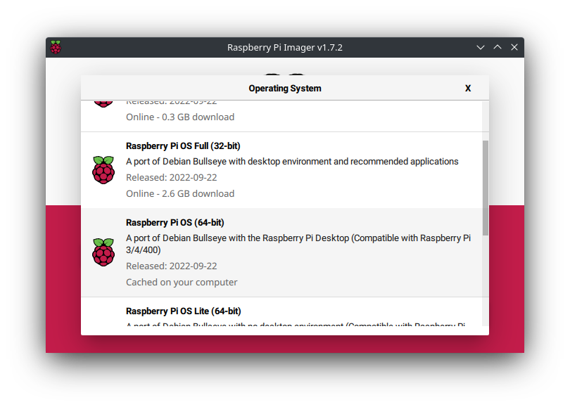

## Raspberry Pi config

### OS Installation

Download the Raspberry Pi imager and install a fresh version of the operating system in a micro SD card.

```shell
sudo apt install rpi-imager
```





Go to extra settings and enable SSH access, configure the WiFi, if needed. Click in **write** and wait for the process to complete.

Insert the micro SD card in the RPi and next, update and upgrade the operating system:

```shell
sudo apt update
sudo apt upgrade

sudo reboot
```

### Expand storage

```shell
sudo raspi-config
```


```shell
sudo reboot
```

### Increase swap memory

Some of the instructions bellow require more memory than the one available in the RPi4. For this, it is recommended to increase the SWAP memory available to the system so that compilation does not fail unexpectedly. Open the `/sbin/dphys-swapfile` and `/etc/dphys-swapfile`, and edit the line `CONF_MAXSWAP=<some_value>` to 4096. After it, reboot the RPi.

```shell
# unmount the swap
sudo dphys-swapfile swapoff

# edit the swap configuration to:
# CONF_SWAPSIZE=2048 
# CONF_MAXSWAP=4096
sudo nano /sbin/dphys-swapfile
sudo nano /etc/dphys-swapfile

# configure with new values
sudo dphys-swapfile setup

# start swap
sudo dphys-swapfile swapon
```

### Camera module

If you have a camera module available, you can enable it by following the [official guide](https://www.raspberrypi.com/documentation/accessories/camera.html)

```shell
sudo raspi-config
```


```shell
sudo reboot
```

## Vulkan SDK


The official installation instructions are available in the [LunarG website](https://vulkan.lunarg.com/doc/sdk/1.3.224.1/linux/getting_started.html).


### Dependencies

```shell
sudo apt install -y \
  bison \
  cmake \
  g++ \
  gcc \
  git \
  libglm-dev \
  liblz4-dev \
  libmirclient-dev \
  libpciaccess0 \
  libpng-dev \
  libwayland-dev \
  libx11-dev \
  libx11-xcb-dev \
  libxcb-dri3-0 \
  libxcb-dri3-dev \
  libxcb-ewmh-dev \
  libxcb-keysyms1-dev \
  libxcb-present0 \
  libxcb-randr0-dev \
  libxml2-dev \
  libxrandr-dev \
  libzstd-dev \
  mesa-vulkan-drivers \
  ninja-build \
  ocaml-core \
  pkg-config \
  python \
  python3 \
  python3-distutils \
  qt5-qmake \
  qtbase5-dev \
  qtbase5-dev-tools \
  qtcreator \
  vulkan-tools
  wayland-protocols
```

### Build and install

Download and build the Vulkan SDK

```shell
mkdir -p ~/local/vulkan
cd ~/local/vulkan

wget -O vulkansdk.tar.gz \
  https://sdk.lunarg.com/sdk/download/1.3.231.2/linux/vulkansdk-linux-x86_64-1.3.231.2.tar.gz

tar -xvf vulkansdk.tar.gz

# remove archive to save space
rm vulkansdk.tar.gz

cd 1.3.231.2

# remove prebuilt x86_64 libraries are not needed in the RPi
rm -rf x86_64

# build the SDK

./vulkansdk -j 4 glslang
./vulkansdk -j 4 vulkan-headers
./vulkansdk -j 4 vulkan-loader
./vulkansdk -j 2 vulkan-validationlayers  # this one consumes all the RAM and uses SWAP memory
./vulkansdk -j 4 vulkan-tools
./vulkansdk -j 4 vulkantools
./vulkansdk -j 4 shaderc
./vulkansdk -j 4 spirv-headers
./vulkansdk -j 4 spirv-tools
./vulkansdk -j 4 spirv-cross
./vulkansdk -j 4 gfxreconstruct
./vulkansdk -j 4 spirv-reflect
./vulkansdk -j 4 vulkan-extensionlayer
./vulkansdk -j 4 vulkan-profiles
./vulkansdk -j 4 DirectXShaderCompiler
./vulkansdk -j 4 volk
./vulkansdk -j 4 VulkanMemoryAllocator
./vulkansdk -j 4 VulkanCapsViewer
```

Configure the `VULKAN_SDK` environment variable permanently in the system:

```shell
# edit .bashrc or .zshrc accordingly
nano .bashrc

# include the following environment variables at the end of the file
export VULKAN_SDK=~/local/vulkan/1.3.231.2/aarch64                                          
export PATH=$VULKAN_SDK/bin:$PATH
```

Reload the profile:

```shell
cd
source .bashrc
```

Install the SDK in the system:

```shell
sudo cp -r $VULKAN_SDK/include/vulkan/ /usr/local/include/
sudo cp -P $VULKAN_SDK/lib/libvulkan.so* /usr/local/lib/
sudo cp $VULKAN_SDK/lib/libVkLayer_*.so /usr/local/lib/
sudo mkdir -p /usr/local/share/vulkan/explicit_layer.d
sudo cp $VULKAN_SDK/etc/vulkan/explicit_layer.d/VkLayer_*.json /usr/local/share/vulkan/explicit_layer.d

sudo ldconfig
````


It is important to install the vulkan libraries as part of the operating system. When Bazel runs the Lluvia tests, is not able to find the layer libraries from the `VULKAN_SDK` environment variable.


## OpenCV


The instructions below are extracted from:

* [PyImageSearch](https://pyimagesearch.com/2018/09/26/install-opencv-4-on-your-raspberry-pi/).
* [QEngineering](https://qengineering.eu/install-opencv-4.5-on-raspberry-pi-4.html)


### Dependencies


```shell
sudo apt install -y \
    build-essential \
    cmake \
    gfortran \
    gstreamer1.0-gl \
    gstreamer1.0-gtk3 \
    libatlas-base-dev \
    libavcodec-dev \
    libavformat-dev \
    libblas-dev \
    libcanberra-gtk* \
    libdc1394-22-dev \
    libgif-dev
    libgstreamer-plugins-base1.0-dev \
    libgstreamer1.0-dev \
    libgtk-3-dev \
    libgtk2.0-dev \
    libhdf5-dev \
    libjasper-dev \
    libjpeg-dev \
    liblapack-dev \
    libopenblas-dev \
    libpng-dev \
    libswscale-dev \
    libtbb-dev \
    libtbb2 \
    libtiff-dev \
    libv4l-dev \
    libx264-dev \
    libxvidcore-dev \
    pkg-config \
    protobuf-compiler \
    python3-dev \
    python3-numpy \
    unzip
```

### Build

```shell
mkdir -p ~/local/opencv && cd ~/local/opencv

# Download and unpack sources
wget -O opencv_contrib.zip https://github.com/opencv/opencv_contrib/archive/4.5.2.zip
wget -O opencv.zip https://github.com/opencv/opencv/archive/4.5.2.zip

unzip opencv.zip
unzip opencv_contrib.zip

mv opencv-4.5.2 opencv
mv opencv_contrib-4.5.2 opencv_contrib

# remove archives
rm opencv.zip
rm opencv_contrib.zip

# Create build directory and switch into it
mkdir -p opencv/build && cd opencv/build

# Configure
cmake -D CMAKE_BUILD_TYPE=RELEASE \
-D CMAKE_INSTALL_PREFIX=/usr/local \
-D OPENCV_EXTRA_MODULES_PATH=~/local/opencv/opencv_contrib/modules \
-D ENABLE_NEON=ON \
-D WITH_OPENMP=ON \
-D WITH_OPENCL=OFF \
-D BUILD_ZLIB=ON \
-D BUILD_TIFF=ON \
-D WITH_FFMPEG=ON \
-D WITH_TBB=ON \
-D BUILD_TBB=ON \
-D BUILD_TESTS=OFF \
-D WITH_EIGEN=OFF \
-D WITH_GSTREAMER=ON \
-D WITH_V4L=ON \
-D WITH_LIBV4L=ON \
-D WITH_VTK=OFF \
-D WITH_QT=OFF \
-D OPENCV_ENABLE_NONFREE=ON \
-D INSTALL_C_EXAMPLES=OFF \
-D INSTALL_PYTHON_EXAMPLES=OFF \
-D BUILD_opencv_python3=TRUE \
-D OPENCV_GENERATE_PKGCONFIG=ON \
-D BUILD_EXAMPLES=OFF ..

# Build
make -j 4

# Install
sudo make install
```

## Lluvia

### Bazel

```shell
wget -O bazel https://github.com/bazelbuild/bazel/releases/download/5.3.2/bazel-5.3.2-linux-arm64

chmod +x bazel
sudo mv bazel /usr/local/bin
```

### Build and install C++ and Python packages

Install clang compiler

```bash
sudo apt install -y clang
```

Clone and build Lluvia

```bash
git clone https://github.com/jadarve/lluvia.git
cd lluvia

# install requirements listed in lluvia's root folder
sudo python3 -m pip install -r requirements.txt

bazel build //lluvia/cpp/...

# Run the tests to verify runtime is configured propertly
bazel test //lluvia/cpp/...

# Build and install the python wheel
bazel build //lluvia/python:lluvia_wheel
python3 -m pip install bazel-bin/lluvia/python/lluvia-0.0.1-py3-none-any.whl
```

### Examples

With the Raspberry Pi camera module installed, it is possible to run the `webcam` demo located at `samples/webcam/webcam.py`

```shell
./samples/webcam/webcam.py --width=320 --height=240 ./samples/webcam/scripts/horn_schunck.lua webcam/HornSchunck
```