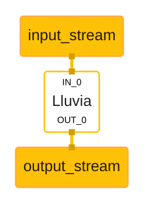
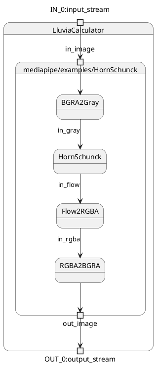

[Mediapipe][1] is a cross-platform framework for creating complex Computer Vision and Deep Learning pipelines both for offline and streaming applications. It includes support to OpenCV and TensorFlow. By integrating Lluvia in mediapipe, it is possible to leverage its runtime capabilities as well as the interfacing with other popular frameworks.

## Setup


The following instructions are written for an Ubuntu host system.


Follow [the linux instructions](./installation/linux) to install the basic dependencies to build lluvia in your host machine.

## Mediapipe

Clone the mediapipe repository in the same folder as lluvia.

```bash
git clone https://github.com/google/mediapipe.git
cd mediapipe
```

Setup Clang as default C++ compiler for mediapipe. Add the following line to mediapipe's `.bazelrc` file

```
build:linux --action_env=CC=clang
```

Follow the [installations instructions](https://google.github.io/mediapipe/getting_started/install.html#installing-on-debian-and-ubuntu) to configure OpenCV according to your installation. Also, enable [GPU support](https://google.github.io/mediapipe/getting_started/gpu_support.html). Once completed, run the `hello_world` application to check the build process: 

```bash
export GLOG_logtostderr=1

bazel run --copt -DMESA_EGL_NO_X11_HEADERS --copt -DEGL_NO_X11 \
    //mediapipe/examples/desktop/hello_world:hello_world
```

the output should look like:

```
I20221006 15:04:52.196460 12142 hello_world.cc:57] Hello World!
I20221006 15:04:52.196496 12142 hello_world.cc:57] Hello World!
I20221006 15:04:52.196501 12142 hello_world.cc:57] Hello World!
I20221006 15:04:52.196537 12142 hello_world.cc:57] Hello World!
I20221006 15:04:52.196563 12142 hello_world.cc:57] Hello World!
I20221006 15:04:52.196588 12142 hello_world.cc:57] Hello World!
I20221006 15:04:52.196615 12142 hello_world.cc:57] Hello World!
I20221006 15:04:52.196640 12142 hello_world.cc:57] Hello World!
I20221006 15:04:52.196666 12142 hello_world.cc:57] Hello World!
I20221006 15:04:52.196691 12142 hello_world.cc:57] Hello World!
```

### Modifications to embed Lluvia as mediapipe's dependency

The next step is to include lluvia as a dependency of mediapipe. Append the configuration below to mediapipe's `WORKSPACE` file to configure lluvia as a `local_repository`:

```python
###########################################################
# LLUVIA
###########################################################
local_repository(
    name = "lluvia",
    path = "../lluvia" # assuming lluvia was cloned in the same folder as mediapipe
)

load("@lluvia//lluvia/bazel:workspace.bzl", "lluvia_workspace")
lluvia_workspace()

# Python configuration
register_toolchains("@lluvia//platform:python_toolchain")

load("@rules_python//python:pip.bzl", "pip_repositories")
pip_repositories()

# Platform configuration
# Linux
load("@lluvia//platform/linux:python.bzl", "python_linux", "numpy_linux")
python_linux(name = "python_linux")
numpy_linux(name = "numpy_linux")

# Windows
load("@lluvia//platform/windows:python.bzl", "python_windows", "numpy_windows")
python_windows(name = "python_windows")
numpy_windows(name = "numpy_windows")

# Packaging rules
load("@ll_rules_pkg//:deps.bzl", "rules_pkg_dependencies")
rules_pkg_dependencies()

# Vulkan rules
load("@rules_vulkan//vulkan:repositories.bzl", "vulkan_repositories")
vulkan_repositories(
    android_use_host_vulkan_sdk = True
)

# Lua rules
load("@rules_lua//toolchains:repositories.bzl", "lua_repositories")
lua_repositories()
```

Rerun mediapipe's `hello_world` binary again to confirm the new workspace configuration works:

```bash
export GLOG_logtostderr=1

bazel run --copt -DMESA_EGL_NO_X11_HEADERS --copt -DEGL_NO_X11 \
    //mediapipe/examples/desktop/hello_world:hello_world
```


### Extra configuration for Android builds

Install [Android Studio](https://developer.android.com/studio), SDK 33 and SDK 30, and the [NDK 21 (r21e)](https://github.com/android/ndk/wiki/Unsupported-Downloads). Configure the `ANDROID_HOME` and `ANDROID_NDK_HOME` environment variables in your `.bashrc` or `.zshrc` file, for instance:

```bash
export ANDROID_HOME=~/local/Android/Sdk
export ANDROID_NDK_HOME=${ANDROID_HOME}/ndk/android-ndk-r21e
```

Install the default JDK and the ADB in the system:

```
sudo apt install default-jdk adb
```

#### WORKSPACE configuration

In addition to the `WORKSPACE` configuration mentioned above, add the following lines for Bazel to configure the Android SDK and NDK.

```python
###########################################################
# ANDROID
###########################################################
android_sdk_repository(name = "androidsdk", api_level = 33, build_tools_version = "30.0.3")
android_ndk_repository(name = "androidndk", api_level=21)
```

## lluvia-mediapipe repository

The [**`lluvia-mediapipe`** project][2] is an auxiliary repository containing the *Calculators* to interface with mediapipe. This repository needs to be cloned within mediapipe in order to consume its dependencies.

```bash
# clone lluvia-mediapipe inside mediapipe

# assuming you are in the in the root folder were mediapipe was cloned
cd mediapipe/mediapipe
git clone https://github.com/jadarve/lluvia-mediapipe.git
```

The directory structure for all repositories should look like:

```
lluvia                          <-- lluvia repository
mediapipe                       <-- mediapipe repository
├── BUILD.bazel
├── docs
├── LICENSE
├── MANIFEST.in
├── mediapipe                   <--
│   ├── BUILD
│   ├── calculators
│   ├── examples
│   ├── framework
│   ├── gpu
│   ├── ...
│   ├── lluvia-mediapipe        <-- lluvia-mediapipe repository
├── ...
├── .bazelrc
└── WORKSPACE
```

Next, run the `lluvia_calculator_test` target to verify the build and the runtime is correctly configured:

```bash
bazel test --copt -DMESA_EGL_NO_X11_HEADERS --copt -DEGL_NO_X11 \
    //mediapipe/lluvia-mediapipe/calculators:lluvia_calculator_test --test_output=all
```

## LluviaCalculator

The `lluvia-mediapipe` repository declares a new **`LluviaCalculator`**. This calculator is in charge of initializing Lluvia, binding input and output streams from mediapipe to lluvia ports, and running a given compute pipeline.

The figure below illustrates a basic mediapipe graph utilizing lluvia, while the code below shows the graph description using protobuffer text syntax



```proto
input_stream: "input_stream"
output_stream: "output_stream"

node: {
  calculator: "LluviaCalculator"
  input_stream: "IN_0:input_stream"
  output_stream: "OUT_0:output_stream"
  node_options {
      [type.googleapis.com/lluvia.LluviaCalculatorOptions]: {
          enable_debug: true
          library_path: "path to .zip node library file"
          script_path: "path to .lua script defining the main container node"
          container_node: "mediapipe/examples/Passthrough"
          
          input_port_binding:  {
              mediapipe_tag: "IN_0"
              lluvia_port: "in_image"
              packet_type: IMAGE_FRAME
          }

          output_port_binding:  {
              mediapipe_tag: "OUT_0"
              lluvia_port: "out_image"
              packet_type: IMAGE_FRAME
          }
      }
  }
}
```

where:

1. The `enable_debug` flag tells whether or not the Vulkan debug extensions used by Lluvia should be loaded during session creation. This flag might be set to `false` in production applications to improve runtime performance.
2. The `library_path` declare paths to node libraries (a `.zip` file) containing Lluvia nodes (Container and Compute). This attribute can be repeated several times.
3. The `script_path` is the path to a `lua` script declaring a `ContainerNode` that Lluvia will instantiate as the "main" node to run inside the calculator.
4. `input_port_binding`, maps mediapipe input tags to the main `ContainerNode` port. In the example above, mediapipe's input tag `IN_0` is mapped to lluvia's `in_image` port.
5. `output_port_binding` does the same for outputs of the `ContainerNode`. Both input and output bindings have a `packet_type` attribute indicating the expected type of the binding. Possible values are: `IMAGE_FRAME` and `GPU_BUFFER`.



Currently there is no support for `GPU_BUFFER` bindings. All bindings must be `IMAGE_FRAME` type.



## Android Archive build

The **lluvia-mediapipe** repo contains an example Android Archive build target that contains the LluviaCalculator as well as some mediapipe graph examples. To build the archive, run:

```bash
bazel build -c opt --host_crosstool_top=@bazel_tools//tools/cpp:toolchain --fat_apk_cpu=arm64-v8a //mediapipe/lluvia-mediapipe/java/ai/lluvia:lluvia_aar
```

The generated AAR file will be located at `bazel-bin/mediapipe/lluvia-mediapipe/java/ai/lluvia/lluvia_aar.aar` and can be exported into an Android project.


## Examples

There are two example applications packed with `lluvia-mediapipe`

### **single_image**

This app receives as command line arguments the path to an image file, a mediapipe graph definition and a lua script describing the *ContainerNode* to run inside of the *LluviaCalculator*.

The commands below execute the `single_image` app loading sample graphs packaged in the repository. The command assumes both *lluvia* and *mediapipe* repositories are cloned in the **`${HOME}/git`** folder. 

#### Passthrough

This graph simply copies the input image to the output, without any processing:

```bash
bazel run --copt -DMESA_EGL_NO_X11_HEADERS --copt -DEGL_NO_X11 \
    //mediapipe/lluvia-mediapipe/examples/desktop/single_image:single_image -- \
    --input_image=${HOME}/git/lluvia/lluvia/resources/mouse.jpg \
    --script_file=${HOME}/git/mediapipe/mediapipe/lluvia-mediapipe/examples/desktop/graphs/passthrough/script.lua \
    --graph_file=${HOME}/git/mediapipe/mediapipe/lluvia-mediapipe/examples/desktop/graphs/passthrough/graph.pbtxt
```





#### BGRA to Gray

This graph runs the [`lluvia/color/BGRA2Gray` compute node](/nodes/lluvia/color/bgra2gray) to convert from the BGRA input to gray scale:

```bash
bazel run --copt -DMESA_EGL_NO_X11_HEADERS --copt -DEGL_NO_X11 \
    //mediapipe/lluvia-mediapipe/examples/desktop/single_image:single_image -- \
    --input_image=${HOME}/git/lluvia/lluvia/resources/mouse.jpg \
    --script_file=${HOME}/git/mediapipe/mediapipe/lluvia-mediapipe/examples/desktop/graphs/BGRA2Gray/script.lua \
    --graph_file=${HOME}/git/mediapipe/mediapipe/lluvia-mediapipe/examples/desktop/graphs/BGRA2Gray/graph.pbtxt
```




### **webcam**

This application tries to open the default camera capture device in the host system using OpenCV `VideoCapture` class. Then it feeds the mediapipe graph the captured frames to be processed by the *LluviaCalculator*.

#### BGRA to Gray

```bash
bazel run --copt -DMESA_EGL_NO_X11_HEADERS --copt -DEGL_NO_X11 \
    //mediapipe/lluvia-mediapipe/examples/desktop/webcam:webcam -- \
    --script_file=${HOME}/git/mediapipe/mediapipe/lluvia-mediapipe/examples/desktop/graphs/BGRA2Gray/script.lua \
    --graph_file=${HOME}/git/mediapipe/mediapipe/lluvia-mediapipe/examples/desktop/graphs/BGRA2Gray/graph.pbtxt
```

#### Horn and Schunck optical flow

This is a more elaborate graph running inside the *LluviaCalculator*. First, the input image is converted from BGRA to gray scale, then is passes through the [Horn and Schunck optical flow algorithm](../../../nodes/lluvia/opticalflow/hornschunck/hornschunck), and finally, the estimated optical flow is converted to RGBA (and then to BGRA) for visualization:



The command to run the example is:

```bash
bazel run --copt -DMESA_EGL_NO_X11_HEADERS --copt -DEGL_NO_X11 \
    //mediapipe/lluvia-mediapipe/examples/desktop/webcam:webcam -- \
    --script_file=${HOME}/git/mediapipe/mediapipe/lluvia-mediapipe/examples/desktop/graphs/HornSchunck/script.lua \
    --graph_file=${HOME}/git/mediapipe/mediapipe/lluvia-mediapipe/examples/desktop/graphs/HornSchunck/graph.pbtxt
```



## References

* [Mediapipe][1]
* [lluvia-mediapipe][2]

[1]: https://mediapipe.dev/
[2]: https://github.com/jadarve/lluvia-mediapipe
