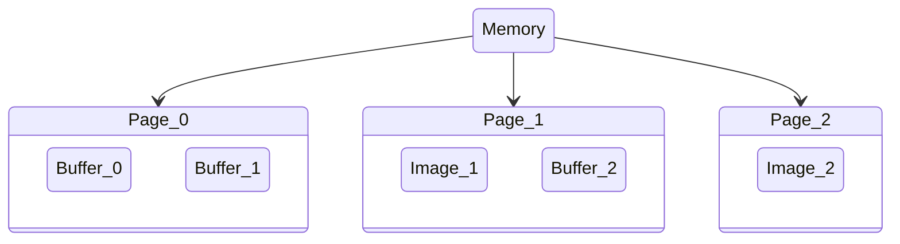
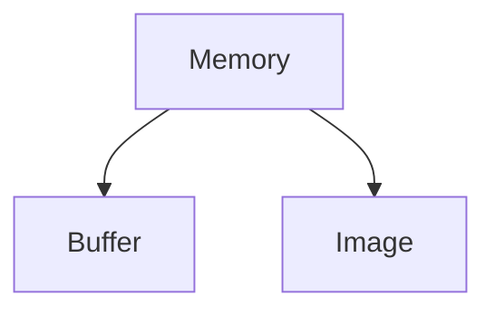

Memory objects represent regions of memory that can be used to allocate objects. Lluvia uses the [memory types][1] defined by the Vulkan API. You may also refer to [this article][2] by Adam Sawicki on how memory is offered by different GPU vendors.


## Memory types

Memory objects are created from a Lluvia `Session`. The [code block](https://github.com/jadarve/lluvia/blob/master/samples/lluvia-docs/memory/test_enumerateMemories.cpp) below enumerate the available memory options:



import lluvia as ll

session = ll.createSession(enableDebug=True)

for n, memflags in enumerate(session.getSupportedMemoryPropertyFlags()):
    print('Memory index:', n)
    print('    supported flags:', [p.name for p in memflags])
    print()


#include <iostream>
#include "lluvia/core.h"

#include <vulkan/vulkan.hpp>

int main() {
    
    ll::SessionDescriptor desc = ll::SessionDescriptor().enableDebug(true);

    std::shared_ptr<ll::Session> session = ll::Session::create(desc);

    std::vector<vk::MemoryPropertyFlags> flagsVector = session->getSupportedMemoryFlags();

    for(int i = 0; i < flagsVector.size(); ++i) {
        const vk::MemoryPropertyFlags &flags = flagsVector[i];
        
        std::cout << "Memory index: " << i << std::endl;
        std::cout << "    Supported flags: " << vk::to_string(flags) << std::endl;
    }

    return 0;
}



{}
```
Memory index: 0
    supported flags: ['DeviceLocal']

Memory index: 1
    supported flags: ['HostCoherent', 'HostVisible']

Memory index: 2
    supported flags: ['HostCached', 'HostCoherent', 'HostVisible']

Memory index: 3
    supported flags: ['DeviceLocal', 'HostCoherent', 'HostVisible']
```
{}

The possible `MemoryPropertyFlags` values are:


| Flag               | Description                                                                                                                                                                           |
|--------------------|-----------------------------------------------------------------------------------------------------------------------------------------------------------------------------------|
| `DeviceLocal`      | The memory is visible to the GPU.                                                                                                                                                 |
| `HostVisible`      | The memory is visible to the host (CPU).                                                                                                                                          |
| `HostCoherent`     | If set, it indicates that read/write operations on the memory are coherent. That is, no flushing is needed for making the values visible by other consumers.                      |
| `HostCached`       | If set, it indiates that read/write operations travel through the host memory cache. Operations may be faster, but need flushing to make the values available to other consumers. |
| `LazilyAllocated ` | Not used in Lluvia.                                                                                                                                                               |


For Lluvia, the two most important memory flag tuples are:

| Tuple                                      | Description                                                                                                                                                                                   |
|--------------------------------------------|-------------------------------------------------------------------------------------------------------------------------------------------------------------------------------------------|
| `(DeviceLocal)`                            | The memory is visible to the GPU only. Computations will be performed on objects allocated in this memory.                                                                                |
| `(DeviceLocal, HostVisible, HostCoherent)` | The memory is visible to both the GPU and the host CPU. Writings to the memory from the host  CPU are coherent. This memory will be used mainly for transfering data to and from the GPU. |


## Creation

The [code block](https://github.com/jadarve/lluvia/blob/master/samples/lluvia-docs/memory/test_createMemory.cpp) below shows how to create memory objects:



import lluvia as ll

session = ll.createSession(enableDebug=True)

deviceMemory = session.createMemory(ll.MemoryPropertyFlagBits.DeviceLocal, pageSize=32*1024*1024, exactFlagsMatch=False)

# use default page size
hostMemory = session.createMemory([ll.MemoryPropertyFlagBits.DeviceLocal,
                                   ll.MemoryPropertyFlagBits.HostVisible,
                                   ll.MemoryPropertyFlagBits.HostCoherent])


#include "lluvia/core.h"
#include <vulkan/vulkan.hpp>
#include <iostream>
#include <memory>

int main() {

    auto session = ll::Session::create(ll::SessionDescriptor().enableDebug(true));
    
    const vk::MemoryPropertyFlags deviceFlags = vk::MemoryPropertyFlagBits::eDeviceLocal;
    const vk::MemoryPropertyFlags hostFlags = vk::MemoryPropertyFlagBits::eDeviceLocal |
                                              vk::MemoryPropertyFlagBits::eHostVisible |
                                              vk::MemoryPropertyFlagBits::eHostCoherent;

    std::shared_ptr<ll::Memory> deviceMemory = session->createMemory(deviceFlags, 32*1024*1024, false);

    std::shared_ptr<ll::Memory> hostMemory = session->createMemory(hostFlags, 32*1024*1024, false);

    return 0;
}



Memories are created by passing the set of flags the memory should have. It is possible to also pass the size of a page, which defaults to 32MB, and an extra parameter to indicate if the flags should match perfectly with any of those listed by `session.getSupportedMemoryPropertyFlags()`.

Internally, a `Memory` manages regions of memory as pages. On each page, there can be several objects allocated, such as `Buffer` or `Image`.



It is possible to query the memory attributes as:



print('flags      :', [p.name for p in hostMemory.memoryFlags])
print('isMappable :', hostMemory.isMappable)
print('pageCount  :', hostMemory.pageCount)
print('pageSize   :', hostMemory.pageSize)


std::cout << "flags      : " << vk::to_string(hostMemory->getMemoryPropertyFlags()) << std::endl;
std::cout << "isMappable : " << hostMemory->isMappable() << std::endl;
std::cout << "pageCount  : " << hostMemory->getPageCount() << std::endl;
std::cout << "pageSize   : " << hostMemory->getPageSize() << std::endl;



which prints:

{}
```
flags      : ['DeviceLocal', 'HostCoherent', 'HostVisible']
isMappable : True
pageCount  : 0
pageSize   : 33554432
```
{}

In particular, the `isMappable` flag tells whether or not the memory space can be mapped to the host memory space. At the moment of creation, there are no actual pages allocated, and hence, `pageCount` equals 0.


## Object allocation

There are two types of objects that can be allocated from a `Memory`:



The [code block](https://github.com/jadarve/lluvia/blob/master/samples/lluvia-docs/memory/test_createObjects.cpp) below shows how to allocate a buffer and an image object. Each allocated object has an `allocationInfo` to see the allocation values.



import lluvia as ll

session = ll.createSession(enableDebug=True)

deviceMemory = session.createMemory(ll.MemoryPropertyFlagBits.DeviceLocal, pageSize=32*1024*1024)

# A 1024 byte size buffer
buffer = deviceMemory.createBuffer(1024)

# A 32x32 pixels image where each pixel is of type Uint8
image = deviceMemory.createImage((32, 32), ll.ChannelType.Uint8)

print('buffer:')
print('  page         :', buffer.allocationInfo.page)
print('  offset       :', buffer.allocationInfo.offset)
print('  left padding :', buffer.allocationInfo.leftPadding)
print('  size         :', buffer.allocationInfo.size)

print()
print('image:')
print('  page         :', image.allocationInfo.page)
print('  offset       :', image.allocationInfo.offset)
print('  left padding :', image.allocationInfo.leftPadding)
print('  size         :', image.allocationInfo.size)


#include "lluvia/core.h"
#include <vulkan/vulkan.hpp>
#include <iostream>
#include <memory>

int main() {
    auto session = ll::Session::create(ll::SessionDescriptor().enableDebug(true));
    
    const vk::MemoryPropertyFlags deviceFlags = vk::MemoryPropertyFlagBits::eDeviceLocal;

    std::shared_ptr<ll::Memory> deviceMemory = session->createMemory(deviceFlags, 32*1024*1024, false);
    
    std::shared_ptr<ll::Buffer> buffer = deviceMemory->createBuffer(1024);
    
    // 32x32 image with one uint8 color channel per pixel
    ll::ImageDescriptor desc = ll::ImageDescriptor(1, 32, 32, ll::ChannelCount::C1, ll::ChannelType::Uint8);
    std::shared_ptr<ll::Image> image = deviceMemory->createImage(desc);
    
    std::cout << "buffer:" << std::endl;
    std::cout << "  page         : " << buffer->getAllocationInfo().page << std::endl;
    std::cout << "  offset       : " << buffer->getAllocationInfo().offset << std::endl;
    std::cout << "  left padding : " << buffer->getAllocationInfo().leftPadding << std::endl;
    std::cout << "  size         : " << buffer->getAllocationInfo().size << std::endl;

    std::cout << std::endl;
    std::cout << "image:" << std::endl;
    std::cout << "  page         : " << image->getAllocationInfo().page << std::endl;
    std::cout << "  offset       : " << image->getAllocationInfo().offset << std::endl;
    std::cout << "  left padding : " << image->getAllocationInfo().leftPadding << std::endl;
    std::cout << "  size         : " << image->getAllocationInfo().size << std::endl;
}



The amount of memory reserved for a given object can be higher than the actual needed. This is because Vulkan imposes certain requirements on the allocation such as alignment.

{}
```
buffer:
  page         : 0
  offset       : 2048
  left padding : 0
  size         : 1024

image:
  page         : 0
  offset       : 0
  left padding : 0
  size         : 2048
```
{}

## What's next

Check the [Objects](/docs/reference/objects) page for an overview of the objects available in Lluvia.

[1]: https://vulkan.lunarg.com/doc/view/1.2.176.1/mac/chunked_spec/chap11.html
[2]: https://asawicki.info/news_1740_vulkan_memory_types_on_pc_and_how_to_use_them

