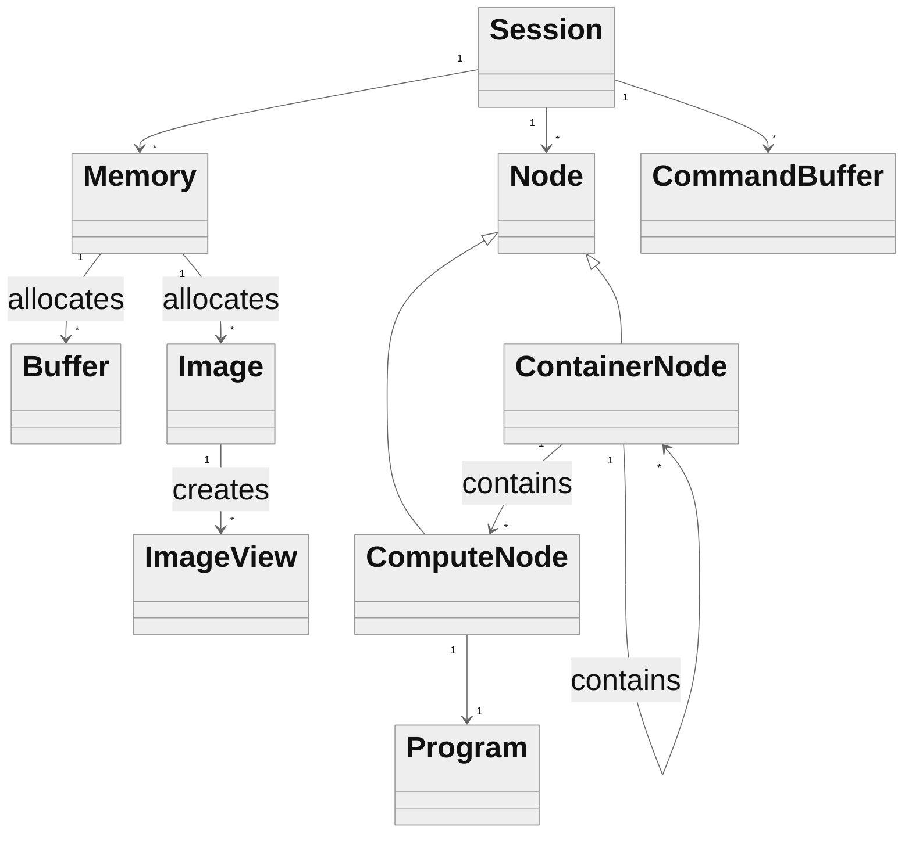

```mermaid
%%{init: {'theme': 'neutral', 'themeVariables': {'fontSize': '32px', 'primaryColor': '#FF0000'}}}%%

classDiagram

    class Session
    class Memory
    class Program
    
    class Buffer
    class Image
    class ImageView

    class Node
    class ComputeNode
    class ContainerNode

    class CommandBuffer

    Session "1" --> "*" Memory
    Session "1" --> "*" Node
    Session "1" --> "*" CommandBuffer

    Memory "1" --> "*" Buffer: allocates
    Memory "1" --> "*" Image: allocates
    Image "1" --> "*" ImageView: creates

    Node <|-- ComputeNode
    Node <|-- ContainerNode

    ComputeNode "1" --> "1" Program

    ContainerNode "1" --> "*" ComputeNode: contains
    ContainerNode "1" --> "*" ContainerNode: contains
```
