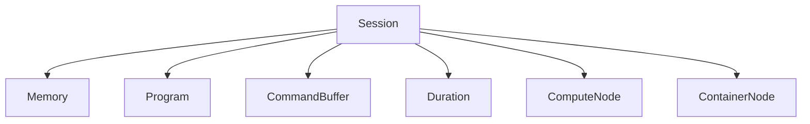

A `Session` is the main object in a Lluvia application. It holds the references to the underlying GPU devices used for computation:



import lluvia as ll

session = ll.createSession(enableDebug=True)


#include <lluvia/core.h>

#include <memory>

int main() {

    auto desc = ll::SessionDescriptor().enableDebug(true);

    std::shared_ptr<ll::Session> session = ll::Session::create(desc);

    return 0;
}



The `enableDebug` flag enables the [Vulkan validation layers](https://github.com/KhronosGroup/Vulkan-ValidationLayers/blob/master/docs/khronos_validation_layer.md) for receiving messages about bad usage of the API. This can be useful while building your compute pipelines, but should be disabled in Production for reducing the communication overhead with the GPU.

Several object types are creating from a session, among the most important are:

## What's next

Check the [Memory](/docs/reference/memory) page to know about the different memory types in Lluvia.
