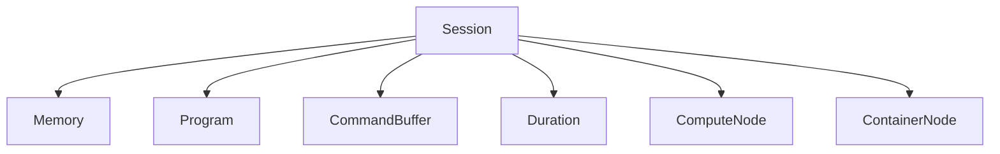

A `Session` is the main object in a Lluvia application. It holds the references to the underlying device used for computation.
To see the available devices, run:



import lluvia as ll

for device in ll.getAvailableDevices():
    print(device)



#include <lluvia/core.h>

#include <iostream>

int main() {

    const auto availableDevices = ll::Session::getAvailableDevices();

    for(auto deviceDesc : availableDevices) {

        std::cout << "ID: " << deviceDesc.id
                  << " type: " << ll::deviceTypeToString(std::forward<ll::DeviceType>(deviceDesc.deviceType))
                  << " name: " << deviceDesc.name << std::endl;
    }

    return 0;
}



and the output can look like:

```
id: 7040 type: DiscreteGPU   name: GeForce GTX 1080
id: 0    type: CPU           name: llvmpipe (LLVM 12.0.0, 256 bits)
id: 1042 type: IntegratedGPU name: Intel(R) HD Graphics 4600 (HSW GT2)
```

To create a session:



import lluvia as ll

devices = ll.getAvailableDevices()

# ... select the device appropriate to your needs
selectedDevice = devices[0]

session = ll.createSession(enableDebug=True, device=selectedDevice)


#include <lluvia/core.h>

#include <memory>

int main() {

    const auto availableDevices = ll::Session::getAvailableDevices();

    // ... select the device appropriate to your needs
    auto selectedDevice = availableDevices[0];

    auto desc = ll::SessionDescriptor()
                    .enableDebug(true)
                    .setDeviceDescriptor(selectedDevice);    

    std::shared_ptr<ll::Session> session = ll::Session::create(desc);

    return 0;
}



{}
If no device is passed during the creation of a `Session`, the default behavior is to select the first
device from the list of available ones.
{}


The `enableDebug` flag enables the [Vulkan validation layers](https://github.com/KhronosGroup/Vulkan-ValidationLayers/blob/master/docs/khronos_validation_layer.md) for receiving messages about bad usage of the API. This can be useful while building your compute pipelines, but should be disabled in Production for reducing the communication overhead with the GPU.

Several object types are creating from a session, among the most important are:




## What's next

Check the [Memory](/docs/reference/memory) page to know about the different memory types in Lluvia.
