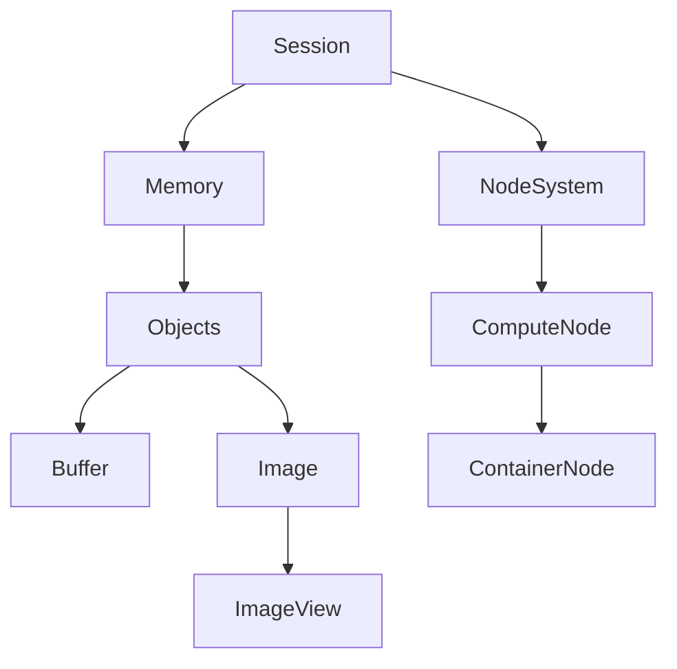

The diagram below illustrates the suggested order for reading the
documentation:

```mermaid
graph
    Session
    Memory

    Session --> Memory
    Memory --> Objects
    Objects --> Buffer
    Objects --> Image
    Image --> ImageView

    Session --> NodeSystem
    NodeSystem --> ComputeNode
    ComputeNode --> ContainerNode

    %% Interaction
    click Session "/docs/reference/session" "Session"
    click Memory "/docs/reference/memory" "Memory"
    click Objects "/docs/reference/objects" "Objects"
    click Buffer "/docs/reference/objects/buffer" "Buffer"
    click Image "/docs/reference/image" "Image"
    click ImageView "/docs/reference/image_view" "ImageView"
    click NodeSystem "/docs/reference/node_system" "NodeSystem"
    click ComputeNode "/docs/reference/node_system/compute_node" "ComputeNode"
    click ContainerNode "/docs/reference/node_system/container_node" "ContainerNode"

```
